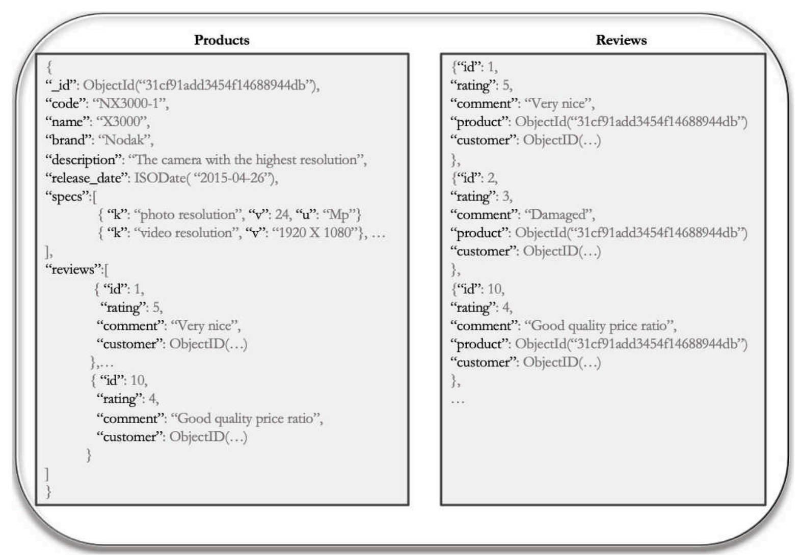

# Design with Mongo DB

## Table of Contents
1. [Polymorphic Model](#chapter_1)
2. [Extended Reference Model](#chapter_2)
3. [Subset Model](#chapter_3)
4. [Outlier Model](#chapter_4)

## Chapter 1 - Polymorphic Model 

*Let's suppose we have a "products" collection belonging to an ecommerce website.*

We will assume that the products offered are very different from each other and span categories such as cameras, smartphones, books, and movies. 

Each of these should have specific features that will help the customer to choose the best product for her needs. However, some of them are common, such as brand, product name, and the description field. We need to find a solution to manage in a homogeneous way something that is actually **very heterogeneous**. 

We need a soltion that allows us to save all our products in a **single collection**, but also helps to dynamically list the characteristics of each product. 

We can define a document as shown below

The structure of the document will contain some **fields that are common to all products**, such as name and brand. These fields are usually the ones we identify as fundamental to describing the objects within the application.

In this way we can keep track of any feature without having to resort to different collections. This model is called **polymorphic** and allows us to accommodate documents with some differences within the same collection, helping to improve the performance of our queries. In fact, in order to access the information of each product **we do not have to differentiate our queries** based on groups defined beforehand, such as the product category. We can also incorporate different products in the same page of the e-commerce, without complicating the logic for querying and displaying product sheets.

We can also **apply the polymorphic model to embedded documents**. Thus, our catalog can be modified by creating an array of embedded documents that will contain all the specifications of a product.

The **advantages and disadvantages** of using this model are summarized below.

## Chapter 2 - Extended Reference Model 

There are situations when it is appropriate to have separate data collections. If an entity can be thought of as a separate “thing”, it often makes sense to have a dedicated collection. In the case of an e-commerce application several distinct concepts exist, such as an order issued by a customer for one or more products, the customer, and the product catalog. They are all **separate logical entities**.

Instead of either incorporating all the customer's information in the order document, or including a reference and then performing a JOIN, we could incorporate only the fields deemed most relevant, i.e. those most frequently accessed and/or used by the application to manage an order, such as the customer's name and address. This pattern is defined as extended reference.

It is an optimal solution when our application has to perform many repetitive JOIN operations. By **identifying the most frequently accessed fields and incorporating them into the main document, performance is greatly improved**.

But then, how do we select which data needs to be duplicated? As always, it depends both on the context and on data access patterns. Let us consider the receipt of an e-commerce site order. In addition to the customer's name, will we need her phone number and current shipping address? Probably not! We can then leave this data out of the order collection and refer to the customer's collection. **Since the data is duplicated, this model works best if the duplicate fields do not change frequently, or their change does not affect the operation of the application**. Fields such as the _id and the person's name are good candidates as they rarely change.

When we need to retrieve some information frequently, we use this model to limit JOIN operations. The referencing document will contain a copy of the strictly necessary fields in the referenced one.

Duplication of data has, as a result, a disadvantage both in terms of space used and because it requires the management of updates distributed over several collections. 

## Chapter 3 - Subset Model 

We will now move on to the management of product reviews by customers, a fundamental aspect of any online store. When the customer looks up a product sheet, she would like to see the most recent reviews. One possibility is to include all reviews within the product document. This would improve access time, avoiding JOIN operations, but in the long run this solution would degrade performance. In fact, Mongo keeps in the main memory the frequently accessed data, called the working set. When the working set exceeds the amount of RAM assigned to the DBMS, the performance degrades progressively, as the data goes is swapped out of RAM and frequent access to the disk begins to occur.

How is it possible to solve this problem?

Instead of storing all reviews together with the product, we can split the collection in two. On the one hand, the collection of products will contain the most used data, e.g. current reviews; on the other hand, a second collection will include the least used data, e.g. old reviews, product history, etc. In general, when duplicating data from a one-to-many (1-N) or many-tomany (N-N) relationship, we need to analyze how the data will be queried.

By using smaller documents that contain the most frequently accessed data, we can reduce the overall size of the working set. This reduces disk access time for the information most often used by an application. However, the application must take on the management, selection, and update of the subset of data. 

## Chapter 4 - Outlier Model 

Although the subset model is an excellent solution for managing product reviews, it requires the duplication of reviews in the product document and a logic for selecting reviews to be included in the referenced document. If we want to avoid these criticalities, we can directly insert all the reviews in the product document. This solution can be effective when, in general, each product receives few reviews.

But what happens when a product is reviewed by many users? In such cases the 16 MB size limit of the BSON document could easily be reached,which would deteriorate performance. How can we deal with these cases?

The outlier model is based on establishing a **threshold for the maximum number of elements in the array field of interest**; in addition, a new field will signal that a given document (the product, in our case study) exceeds the threshold and, therefore, is an outlier for the context.

We will move the excess information to a document in a separate collection and link it to the product's _id. Within the application, we will then be able to determine if a document has an extra_review field with a value equal to true. In that case, the application may retrieve the additional information when necessary.

The outlier model is an advanced model, which can lead to great performance improvements. It is often used in situations where the notion
of popularity is an important factor.

