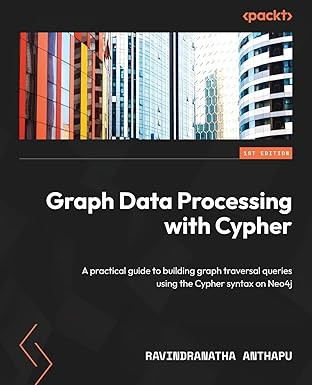
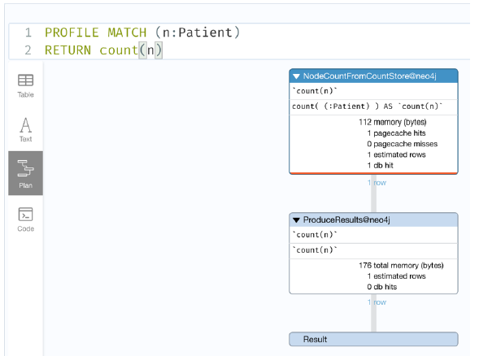
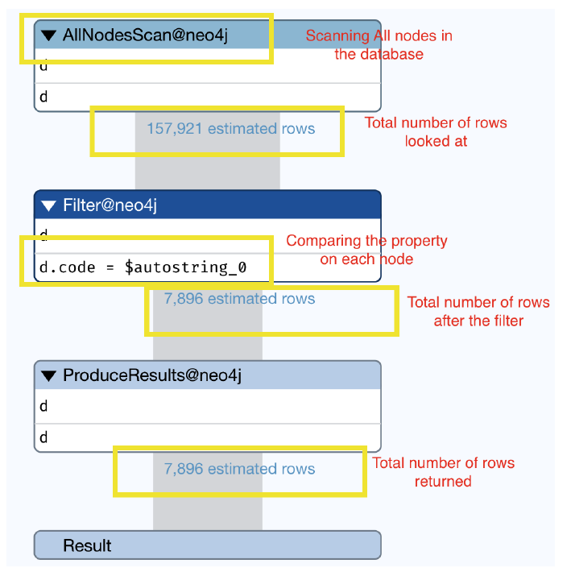
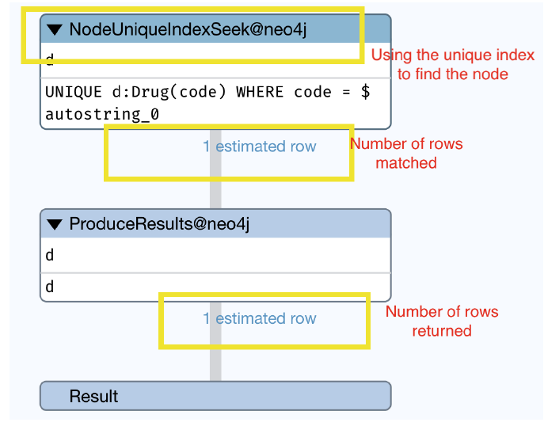
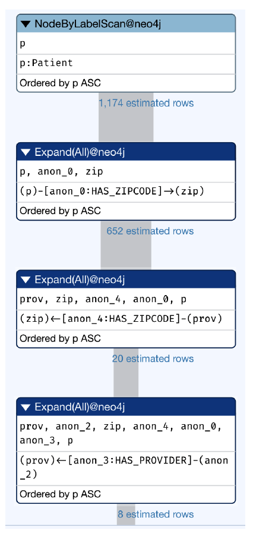
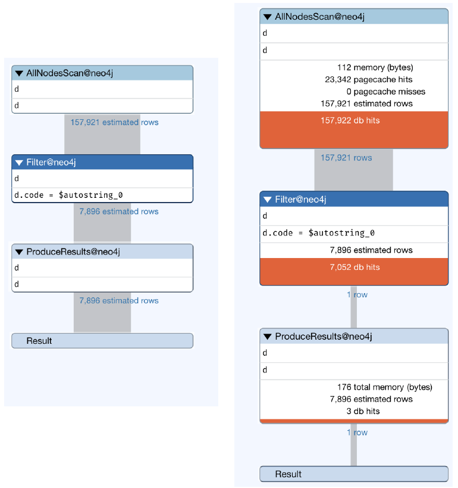
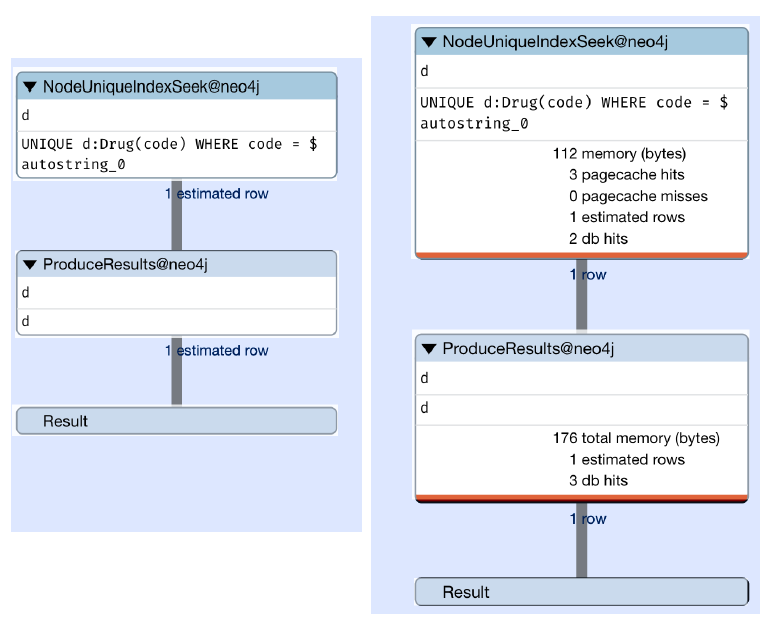

# Graph Data Processing with Cypher



## Table of Contents
1. [Introduction to Neo4j and Cypher](#chapter_1)
2. [Components of Cypher](#chapter_2)
3. [Loading Data with Cypher](#chapter_3)
4. [Querying Graphs](#chapter_4)
5. [Filtering, Sorting, and Aggregations](#chapter_5)
6. [List Expressions, UNION, and Subqueries](#chapter_6)
7. [Working with Lists and Maps](#chapter_7)
8. [Advanced Query Patterns](#chapter_8)
9. [Query Tuning](#chapter_9)


## Chapter 1 - Introduction to Neo4j and Cypher <a name="chapter_1"></a>

- https://graphacademy.neo4j.com/courses/neo4j-fundamentals/
- https://graphacademy.neo4j.com/courses/cypher-fundamentals/


## Chapter 2 - Components of Cypher <a name="chapter_2"></a>

Cypher is a declarative query language that makes it easy to write expressive and efficient queries to traverse, update, and administer a graph database.

Cypher expands upon a variety of established practices for querying. For example, the WHERE, ORDER BY, and CASE keywords are inspired by the SQL syntax. Some of the list semantics are borrowed from Haskell and Python.

### Using the Cypher syntax

A simple Cypher traversal query can look like this:

```
(A)-[:LIKES]->(B), (B)-[:LIKES]->(C), (A)-[:LIKES]->(C)
```

This can also be rewritten as follows

```
(A)-[:LIKES]->(B)-[:LIKES]->(C)<-[:LIKES]-(A)
```

### Property Types

- Number
  - Integer
  - Float
- String
- Boolean
- Spatial
  - Point
- Temporal
  - Date
  - Time
  - LocalTime
  - DateTime
  - LocalDateTime
  - Duration
- Composite 
  - List
  - Map

Property types can have the following characteristics
- Can be part of data returned by queries
- Can be used as input parameters
- Can be stored as properties on nodes or relationships

### Using the node syntax

In Cypher, a node is surrounded by parethesis, (), making it resemble a circle in a diagram.

Examples:
- (p) - This represents a node a node identified with the p variable/alias. It can be of any type
- () - This represents a node that is not assigned a variable or an alias. This is normally called an anonymous node, as it cannot be referenced later, except as part of a path
- (:Person) - This represents a node with the Person label, but is not assigned to a variable or alias
- (p:Person) - This represents a node with the Person label, identified with the p variable/alias
- (l:Location:Work) - This represents a node with multiple labels, Location and Work, identified with the l variable/alias

### Using the relationship syntax

In Cyper, a relationship can be represented using -->, which resembles an arrow on a diagram.

- (p)-[:LIVES_AT]->(a) - This represents that the node identified by p is connected to another node, a, with a LIVES_AT relationship type. The direction of the relationship is from p to a
- (p)-[r]->(a) - This represents that the node identified by p is connected to another node, a, with a relationship going from p to a. They can be connected via any relationship type. The relationship is assigned the r variable/alias
- (p)-[r]-(a) - As above, but undirected relationship
- (p)-->(a) - Anonymous relatioship

### Working with Cypher keywords

#### Usign MATCH and OPTIONAL MATCH

The MATCH keyword allows you to specify the graph traversal patterns to find and return the data from Neo4j. It is most often coupled with a WHERE clause to filter out the results, and a RETURN clause to return the results.

The following query, can be written in 2 ways regarding filtering

```
MATCH (n:Movie)
WHERE n.title = 'My Movie'
RETURN n.released
```

```
MATCH (n:Movie {title: 'My Movie'})
RETURN n.released
```

The OPTIONAL MATCH clause works similarly to MATCH with the exception that when there is no data matching the pattern specified, it will not stop the execution and returns null as result.

The following query explains that behavior
- If the database does not contain nodes with Movie or Person labels, then this query will not return any results. If nodes with these labels are present, then you will see a cartesian product of these values 
    ``` 
    MATCH (m:Movie) 
    MATCH (p:Person)
    RETURN m.title, p.name
    ```
- In this query, if there are no nodes with the Movie label, then no results are returned. If the Movie nodes do exist but there are no nodes with the Person label, then the query would still return he results with p.name as null for each row
    ``` 
    MATCH (m:Movie) 
    OPTIONAL MATCH (p:Person)
    RETURN m.title, p.name
    ```
- In this query, if no nodes with the Movie or Person label exist, then a single row with null values is returned. If there are nodes with either a Movie or Person label, then the cartesian product of those values is returned
    ``` 
    OPTIONAL MATCH (m:Movie) 
    OPTIONAL MATCH (p:Person)
    RETURN m.title, p.name
    ```

#### Using CREATE and DELETE

The CREATE clause will let you create new nodes and relationships. For CREATE statements, the return is optional.

- This query will create a node with the Person label and a name property, and returns the node.Always create labeled nodes for query efficiency
    ```
    CREATE (p:Person {name: 'Tom'})
    RETURN p
    ```
- We can also create nodes and relationships together
    ```
    CREATE (p:Person {name: 'Tom'})
    - [:LIVES_AT] ->
    (a:Address {city: 'New York', country: 'USA'})
    ```

The DELETE clause will let you delete nodes and relationships.

- This query finds a Person node named Tom and deletes from the database. This can fail if this node has any relationships
    ```
    MATCH (p:Person {name: 'Tom'})
    DELETE p
    ```
- This query finds a Person node named Tom and deletes the node and all the relationships the node is attached to from the database
    ```
    MATCH (p:Person {name: 'Tom'})
    DETACH DELETE p
    ```
- This query deletes all the relationships with the LIVES_AT type for the person node with the name Tom, keeping the node as it is
    ```
    MATCH (p:Person {name: 'Tom'})-[r:LIVES_AT]->()
    DELETE r
    ```
- To deelte all the nodes and relationships in the database (depending on how much data is in the database, this could lead to an OutOfMemory error)
    ```
    MATCH (n)
    DETACH DELETE n
    ```

#### SET and REMOVE

The SET clause allows you to set properties or labels on a node, or set the properties on relationships. It can be used in conjunction with MATCH or CREATE clauses.

- This query finds the Person node name Tom and sets the age to 20:
    ```
    MATCH (n:Person {name: 'Tom'})
    SET n.age = 20
    ```
- This query finds the Person node name Tom and adds the additional label, Actor, to it
    ```
    MATCH (n:Person {name: 'Tom'})
    SET n:Actor
    ```

The REMOVE clause is used to remove or delete properties from nodes or relationships. It can also remove labels from nodes.

- This query finds a Person node that has the Actor label and is named Tom, and remove the Actor label from the node
    ```
    MATCH (n:Person:Actor {name: 'Tom'})
    REMOVE n:Actor
    ```
- We can do the same to remove the property age
    ```
    MATCH (n:Person:Actor {name: 'Tom'})
    REMOVE n.age
    ```

#### Using WHERE, SKIP, LIMIT, ORDER BY

- WHERE, LIMIT and ORDER BY are the equivalent of their SQL counterpart
- SKIP is the same of OFFSET in SQL

#### Using MERGE

A MERGE is an upsert operation. It will check for the existence of the node or path and if it doesn't exist, it tries to create the node or path as applicable.

Remember, MERGE creates at maximum one node. When you run a MERGE multiple times, it does not create multiple nodes.

The MERGE operation is not thread safe. If you want to run the same query in parallel in multiple threads, it can create multiple nodes. To avoid this, you should use constraints.

MERGE is often used to make sure we do not create duplicate nodes and relatioships in the database.

- This query makes sure there is only one Person node that exists in the database named Tom and aged 30. You should try to use node primary key values only with the MERGE statement
    ```
    MERGE (p:Person {name: 'Tom', age: 30})
    RETURN p
    ```

At runtime, MERGE lets us know whether a new node is being create or whether a handle to an existing node is returned. We can identify these scenarios using ON CREATE and ON MATCH clauses in conjunction with a MERGE clause. Both of those clauses are optional.

```
MERGE (p:Person {name: 'Tom', age: 30})
ON CREATE
SET p.created = timestamp()
ON MATCH 
SET p.updated = timestamp()
RETURN p
```

#### Using FOREACH

A FOREACH clause will let you iterate over a list of values and perform write operations using CREATE, MERGE, DELETE, SET or REMOVE clauses. You cannot use a MATCH clause within a FOREACH clause.

- Assuming nodeList contains a list of nodes, this query will iterate over each node and set its marked properties to true
    ```
    FOREACH (
        n IN nodesList |
        SET n.marked = true
    )
    ```

#### Using UNWIND

The UNWIND clause converts a list into rows so that each entry can be processed.
The UNWIND clause can be seen as the equivalent of the EXPLODE clause in SQL.

- The following query will return 4 rows, one for each element in the defined list
    ```
    WITH [1,2,3,4] AS list
    UNWIND list AS x
    RETURN x
    ```

#### Using UNION and UNION ALL

The UNION clause is used to combine the result of two or more queries. Each query must return the same number of values ("columns") with the same alias name.

UNION will only return distinct values across query results. UNION ALL will return all values without filtering duplicate rows.

```
MATCH (n:Actor)
RETURN n.name AS name
UNION 
MATCH (n:Movie)
RETURN n.title AS name
```

#### Using indexes and constraints

Indexes and constraints play a critical role in obtaining optimal performance from the database, along with making sure data integrity is mantained.

Deep-dive here -> https://graphacademy.neo4j.com/courses/importing-cypher/


## Chapter 3 - Loading Data with Cypher <a name="chapter_3"></a>

Deep-dive here 
- https://graphacademy.neo4j.com/courses/importing-fundamentals/
- https://graphacademy.neo4j.com/courses/importing-cypher/

## Chapter 4 - Querying Graphs <a name="chapter_4"></a>

Deep-dive here -> https://graphacademy.neo4j.com/courses/cypher-fundamentals/


## Chapter 5 - Filtering, Sorting, and Aggregations <a name="chapter_5"></a>

Deep-dive here -> https://graphacademy.neo4j.com/courses/cypher-aggregation/


## Chapter 6 - List Expressions, UNION, and Subqueries <a name="chapter_6"></a>

### Working with list expressions

Cypher provides native support for lists. This means that not only are they treated as first-class entities, such as integers or strings, but all the functions that can create, manipulate, or process the lists are built into Cypher.

- The **range** function provides a way to create a list with numbers
    ```
    range(start, end [, step])
    ```
- The **head** function returns the first element of a list
    ```
    WITH [1,2,3,4] as list
    RETURN head(list) // 1
    ```
- The **tail** function returns all the elements except for the first element of a list.
    ```
    WITH [1,2,3,4] as list
    RETURN tail(list) // [2,3,4]
    ```
- The **last** function returns the last element in a list.
    ```
    WITH [1,2,3,4] as list
    RETURN last(list) // 4
    ```
- The **size** function returns the number of elements in a list.
    ```
    WITH [1,2,3,4,10,15] as list
    RETURN size(list) // 6
    ```
- The **reverse** function returns the elements of a list in reverse order.
    ```
    WITH [1,2,3,4,10,15] as list
    RETURN reverse(list) // [15,10,4,3,2,1]
    ```

#### Working with reduce

The **reduce** function is used to aggregate a result by traversing the list.

This function will iterate through each of the elements in the given list, run the expression on element e, while taking into account the current partial result, and store the new partial result in the accumulator value.

```
The syntax of this function looks like this. 
reduce(accumulator = initial, variable IN list | expression)
```

The following table explains the arguments of the reduce function:

| Name | Description |
|------|-------------|
|accumulator| A variable that will hold the result, and the partial results, as we iterate through the list.|
|initial| Expression to assign an initial value to the accumulator.|
|list| An expression that returns a list.|
|variable| The variable is used to assign the element while we iterate through the list.|
|expression| The expression will run once for each value in the list, and produce the result value.|

Let us look at the usage of this function:

```
WITH [1,2,3,4,10,15] as list
RETURN reduce(sum=0, x in list | sum + x) as total // 35
```

#### Working with list comprehensions

List comprehensions are a means to create lists from other lists, based on expression evaluation of the elements of the original list.

```
WITH [1,2,3,4,10,15] as list
RETURN [x in list WHERE x % 2 = 0 | x*x ] as squareList // [4,16,100]
```

### UNION and UNION ALL

// See Chapter 2

### Working with subqueries

#### Returning subqueries

Subqueries that **end with a RETURN statement** are called returning subqueries. 
Every row from a returning subquery is combined with the input row to prepare the result of the query. 

This means the final output of the outer query can be impacted by the subquery returned values.

**Note** If a subquery does not return any rows, then there will not be any rows returned by the outer query.

It is also possible to combine the results from the outer query and subquery. Let’s look at an example of this:

```
MATCH (p:Patient {id:'f237e253-9052-a038-7c9e-dbd9a1d7da32'})
CALL {
    WITH p
    MATCH (p)-[:HAS_ENCOUNTER]->()-[:HAS_DIAGNOSIS]->(d)
    RETURN d as drug
}
WITH DISTINCT p, drug
RETURN
    p.firstName as firstName,
    drug.code as code,
    drug.description as drug
```

#### Unit subqueries

Unit subqueries **do not use the RETURN clause**. This means we can only perform data updates when we use this pattern. 

Since there is no RETURN clause in the subquery, the number of rows returned by the enclosing query is not affected by what the subquery does.

```
UNWIND range (1, 5) AS index
CALL {
    WITH index
    CREATE (t:Test {id:index})
}
RETURN index
```


## Chapter 7 - Working with Lists and Maps <a name="chapter_7"></a>

### Working with lists

Lists are the core data type in Cypher and because of this, there is extensive support for lists in Cypher.

- Lists hold elements in a sequence so that we can iterate the list in any order. 
- They can hold any type of value
- All of the elements in a list can be of the same type: whether integer, string, map, or list
- It is also possible to mix and match different types in the same list

Let's now take a look at some of the list capabilities:

- **Concatenating** two lists
    ```
    WITH [1,2,3,4] as intList, ['test1', 'test2', 'test3'] as strList
    RETURN intList+strList as final // [1,2,3,4,'test1', 'test2', 'test3']
    ```
- **Indexed access** to list elements
    ```
    WITH [1,2,[10,11],3,4] as list
    RETURN list[0] as e1, list[2] as e2 , list[-1] as e3 
    // e1=1, e2=[10,11], e3=4
    ```
- The **IN** operator lets us check whether a given value is in the list or not
    ```
    WITH [1, 2, 3, 4, 5] as list
    UNWIND list as n
    WITH n
    WHERE n IN [2,4,8]
    RETURN n // [2,4]
    ```
- The **COLLECT** function allows data to be collected into a list
    ```
    MATCH (d:Drug)
    WITH d
    LIMIT 3
    RETURN COLLECT(d.code) // [..., ..., ...]
    ```

### Working with maps

Maps in Cypher represent **key-value pairs**. The keys must be strings and values can be any object. Maps can be defined in Cypher inline, where they are called literal maps, or they can be passed as parameters. 

Every node and relationship object can also be treated as a map in Cypher, so that we can **access** all the properties using **dot** (.) notation or **index** ([ ]) notation.

A map is like a JavaScript Object Notation (JSON) object.
```
{
    "firstName": "John",
    "lastName": "Smith",
    "isAlive": true,
    "age": 27
}
```
If we represented the same map in Cypher, it would look like this:
```
WITH {
    firstName: "John",
    lastName: "Smith",
    isAlive: true,
    age: 27
} as map
RETURN map
```

Let's take now a look at a slightly more complex example
```
WITH {
    firstName: "John",
    lastName: "Smith",
    isAlive: true,
    age: 27,
    address: {
        line1: "1 address ln",
        city: "Newark",
        state: "NJ",
        country: "USA"
    },
    aliases: ["Johny", "John"]
} as map
RETURN 
    map.firstName, 
    map.lastName, 
    map.address.state, 
    map.aliases[0]
```

#### Working with map projections

Cypher provides a concept called map projections. Map projections are a very useful tool to build a simple response from node or relationship entities to return only the content we need. They are maps built using nodes, relationship properties, and other values.

```
MATCH (d:Drug)
WITH d
LIMIT 10
RETURN d{.code, .description, label: labels(d)[0]} // to return all -> d{.*}
```


## Chapter 8 - Advanced Query Patterns <a name="chapter_8"></a>

### Working with the WITH clause

In Cypher, the WITH clause allows individual queries to be chained together by streaming the results from the first part of the query to the next part of the query. It allows you to manipulate the query result before it is passed on to the next part of the query.

//TODO

### Working with the CASE clause

In simple CASE expressions, the expression is evaluated and compared to the WHEN clauses. The corresponding expression is then evaluated and the resulting value is returned. If no value is found, the ELSE clause expression is evaluated and the corresponding value is returned. If there is no ELSE clause, then a null value is returned.

The syntactic representation of this looks like this:
```
CASE test
    WHEN value THEN result
    [WHEN ...]
    [ELSE default]
END
```

Let’s take a look at an example usage:
```
MATCH (p:Patient)
RETURN p.ssn as patient, 
    CASE p.marital
    WHEN "S" THEN "Single"
    WHEN "M" THEN "Married"
    ELSE "UNKNOWN"
END as status
```

#### Working with generic CASE expressions

```
CASE
    WHEN predicate THEN result
    [WHEN …]
    [ELSE default]
END
```

We can see that we don’t have a value expression after the CASE clause here.

### Working with the FOREACH clause

The FOREACH clause can be used to process a list and update the data in a graph. 

It can only be used to update data using the CREATE, MERGE, SET, DELETE, REMOVE, and FOREACH clauses. It is not possible to use the MATCH clause within FOREACH. 

Also, the variables in the context of the FOREACH clause are limited to its scope only and there is no option to remove those variables to be used after FOREACH.

Let’s look at an example usage:
```
MATCH (p:Patient)
WHERE p.marital IS NULL
WITH collect(p) as nodes
FOREACH( n in nodes | SET n:UNKNOWN_STATUS)
```

### Working with the UNWIND clause

// See Chapter 2

### Working with the count stores

Neo4j maintains certain data statistics as count stores. For example, there are node count stores that maintain the counts of nodes for each label type. Since our dataset is small, we will use PROFILE to understand how much work the database would be doing in terms of db hits, with and without count stores, for a given type of work. We will also take a look at how to leverage count stores to build more
performant queries.

Let’s look at a sample node count store query:
```
PROFILE MATCH (n:Patient)
RETURN count(n)
```
This is a very basic query, and it leverages count stores instead of counting the nodes that have the Patient label.

We can see from the screenshot, the database uses NodeCountFromCountStore@neo4j, which looks for the totals from the count store. We can see that it takes one db hit. The performance is constant, no matter how large the database grows.




## Chapter 9 - Query Tuning <a name="chapter_9"></a>

We have two options available to tune queries. 
- **EXPLAIN**
  - Takes the Cypher query and provides an estimated amount of work the database might do. It does not execute the query. 
- **PROFILE**
  - This will execute the query and gives the exact amount of work the database is doing. 

### Working with EXPLAIN

The EXPLAIN clause returns a query execution plan as the database sees it. It does not actually execute the query and does not return data. It does not make any changes to the database itself. 

It can be used to easily identify missing indexes or query plans not using existing indexes, and so on. Also, it tells us how a query is traversing relationships to do its work.

Example
```
EXPLAIN MATCH (d {code:'313820'})
RETURN d
```

Notice that we **did not provide a label** in the query. This is intentional to showcase how a query plan can be used to identify issues.



We can see from the following screenshot that the first step we are doing is **AllNodesScan**. What this means is that we are looking at the whole database to find the node we want and that we either have a mistake in the query or we are missing an index.

We can also see that the query plan provides estimated rows returned in each step. These are approximate values based on statistics collected by the database and not exact values.

Now, let’s add the missing label and retry the plan again:

```
EXPLAIN MATCH (d:Drug {code:'313820'})
RETURN d
```



This is better—even though we don’t know exact performance benchmarks as such, this indicates the database query planner knows there is a unique index on the Drug label and the code property and tells the database to use it when it executes the query.

Let us try a slightly more complex query and see its plan:
```
EXPLAIN MATCH (p:Patient)-[:HAS_ZIPCODE]->(zip)
WITH p, zip
MATCH (p)-[:HAS_ENCOUNTER]->()-[:HAS_PROVIDER]->(prov)-[:HAS_ZIPCODE]->(zip)
WITH DISTINCT p, prov, zip
RETURN p.firstName as patientFirst,
    p.lastName as patientLast,
    prov.name as provider,
    zip.zip as zipcode
```



We can see that the first step here is to do something called **NodeByLabelScan**. Since we did not provide any property or WHERE clause to limit the results in the first line of the query, it is finding all nodes identified by the Patient label.

The reason it is **starting from** the Patient label is that we have not **specified** a **label** for the other node in the query. Due to this, the query planner starts from a known label first. If it had to start from zip, it would have to do AllNodesScan, which is a costlier operation than NodeByLabelScan.

Another thing we notice here is that once it finds the patient nodes, it is ordering them in ascending order. If we notice in the query, we do not have ORDER BY anywhere.

Then, why is the query planner looking to **order the nodes**?

If we go to the next part of the query, we are doing this:
```
WITH DISTINCT p, prov, zip
```

Since we want the distinct values, it is trying to order by the patient nodes first so that it can **eliminate duplicates easily**. Sorting the dataset when it is small and exploring from there could be more **cost effective** than collecting all the data and trying to sort; considering all the different combinations could be costlier. The query planner could be considering this aspect and sorts the patient nodes immediately.

Next, it traverses the HAS_ZIPCODE relationship and collects the zip codes:

```
MATCH (p)-[:HAS_ENCOUNTER]->()-[:HAS_PROVIDER]->(prov)-[:HAS_ZIPCODE]->(zip)
```

In the query, we are starting from the patient node, but the query planner is **starting from the zip code node**. This is because the **total number of zip code nodes is a lot less**, so it is trying to start from there and going backward. It is traversing this way and collecting all the providers.

### Working with PROFILE

The PROFILE clause executes as per the plan created by the database and provides the **exact cost of the query**. It will keep track of how many rows pass through the operators and the amount of work the database is doing that is measured as database hits.

Let’s look at a basic example and compare the EXPLAIN and PROFILE plans:
```
PROFILE MATCH (d {code:'313820'})
RETURN d
```

In the query, we can see that the only difference is we are using PROFILE instead of EXPLAIN:



We can see that the plan remained exactly the same, but we are seeing the db hits, which are the measurement of how much work the database is doing. You can think of 1 db hit as a unit of work the database is doing. More db hits mean a plan step is taking more work than the database is doing to complete that step in the query. Also, more db hits mean that it’s taking more time to execute the query. 

Let’s look at the profile of the query with a label:

```
PROFILE MATCH (d:Drug {code:'313820'})
RETURN d
```

We are using PROFILE here with a Drug label in the query. We will compare the EXPLAIN and
PROFILE plans for this query in the following screenshot:



### Reviewing plan operators

We will take a look at a few important operators that we will encounter most often while tuning queries.
These operators impact query performance the most and are listed as follows:
- **AllNodesScan**: This means the database is looking at all the nodes. Most often than not, this means the user forgot to provide a label. There are scenarios where this might be the intention.
- **CartesianProduct**: This is a scenario when we have multiple MATCH statements without the WITH clause between them. A sample of such a scenario looks like this:
    ```
    MATCH (p:Patient)
    MATCH (d:Drug)
    RETURN p,d
    LIMIT 10
    ```
    In this scenario, we are creating a Cartesian product of the response. Unless we are sure we need this scenario, when CartesianProduct appears in the query plan, we want to take a look at the query and see how we can avoid it.
- **NodeUniqueIndexSeek**: This means we are finding a unique node leveraging the index. As much as possible, this should be the approach to find the initial node and then traverse from there. *This also means for the node label and property, there is a unique constraint that exists*.
- **NodeIndexScan**: This means we are trying to find all nodes that match the label and property by looking at the whole index. *This means we have an index created, but it is not a unique constraint*. This is going to be way faster than a label scan.
- **NodeByLabelScan**: This means we have provided the label, but either *we are not providing any property or there is no index on the label and property combination*. 

