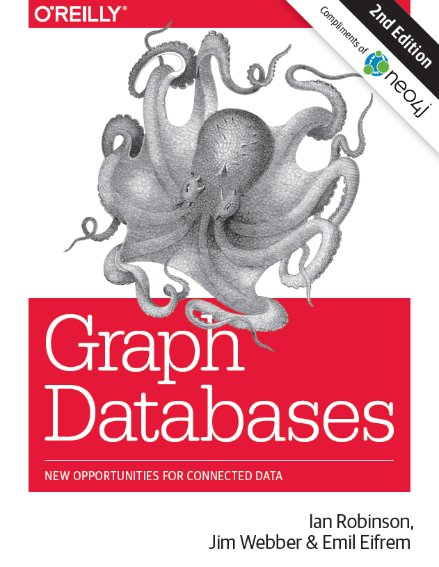
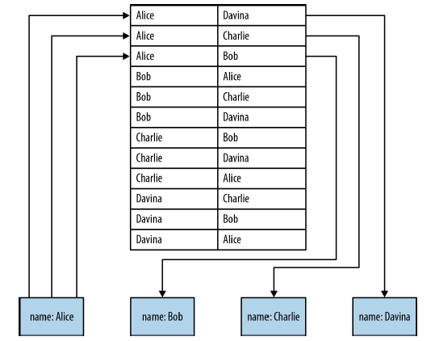
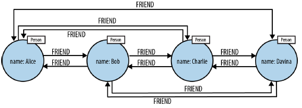
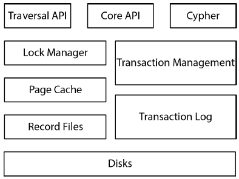
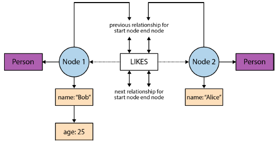

# Graph Databases Internals

---

*This file contains only one chapter of the book: **Graph Database Interals***

Other parts are redundant with respect to other books or courses in this GIT repository.

---

## Native Graph Processing

Although the property graph model itself is reasonably consistent across graph database implementations, there are numerous ways to encode and represent the graph in the
database engine’s main memory. 

Of the many different engine architectures, we say that a graph database has **native processing** capabilities if it exhibits a property called **index-free adjacency**.

A database engine that utilizes index-free adjacency is one in which each node maintains direct references to its adjacent nodes. Each node, therefore, acts as a microindex of other nearby nodes, which is much cheaper than using global indexes. It means that **query times** are independent of the total size of the graph, and are instead **simply proportional to the amount of the graph searched**.

A **nonnative graph database engine, in contrast, uses (global) indexes to link nodes together**, as shown in the figure below. These indexes add a layer of indirection to each traversal, thereby incurring greater computational cost. Proponents for native graph processing argue that index-free adjacency is crucial for fast, efficient graph traversals.

To understand why native graph processing is so much more efficient than graphs based on heavy indexing, consider the following. Depending on the implementation, **index lookups** could be O(log n) in **algorithmic complexity** versus O(1) for looking up immediate relationships. To traverse a network of m steps, the cost of the indexed approach, at O(m log n), dwarfs the cost of O(m) for an implementation that uses index-free adjacency.

---

### Index-Free Adjacency Leads to Low-Cost “Joins”

With index-free adjacency, bidirectional joins are effectively precomputed and stored in the database as relationships. In contrast, **when using indexes to simulate connections between records**, there is no actual relationship stored in the database. From this, two problems arise:
- Using a global index lookup is typically far more **expensive algorithmically** than traversing a physical relationship
- using indexes to simulate connections becomes **problematic** when we try to **traverse in the “opposite” direction** from the one for which the index was constructed

--- 

Graph databases with native graph processing capabilities use index-free adjacency to ensure high-performance traversals.
The figure below shows how relationships eliminate the need for index lookups.

Recall that in a general-purpose graph database, relationships can be traversed in either direction (tail to head, or head to tail) extremely cheaply. As we see in

Looking at the previous figure, to find Alice’s friends using a graph, we simply follow her outgoing FRIEND relationships, at O(1) cost each. To find who is friends with Alice, we simply follow all of Alice’s incoming FRIEND relationships to their source, again at O(1) cost each.

Given these costs, it’s clear that, in theory at least, graph traversals can be very efficient. But such high-performance traversals only become reality when they are supported by an architecture designed for that purpose.

## Native Graph Storage

If index-free adjacency is the key to high-performance traversals, queries, and writes, then one key aspect of the design of a graph database is the way in which graphs are
stored. 

An efficient, native graph storage format supports extremely rapid traversals for arbitrary graph algorithms—an important reason for using graphs. 

For illustrative purposes we’ll use the Neo4j database as an example of how a graph database is architected.

Neo4j stores graph data in a number of different store files. **Each store file contains the data for a specific part of the graph** (e.g., there are separate stores for nodes, relationships, labels, and properties). 

The division of storage responsibilities—particularly the **separation of graph structure from property data**—facilitates performant graph traversals, even though it means the user’s view of their graph and the actual records on disk are structurally dissimilar.

The node store file stores node records. Every node created in the user-level graph ends up in the node store, the physical file for which is neostore.nodestore.db. Like most of the Neo4j store files, the node store is a fixed-size record store, where each record is nine bytes in length. **Fixed-size records enable fast lookups for nodes in the store file**. 
If we have a node with id 100, then we know its record begins 900 bytes into the file. Based on this format, the database can directly **compute a record’s location, at cost O(1)**, rather than performing a search, which would be cost O(log n).

--- 

### Doubly Linked Lists in the Relationship Store

It’s helpful to think of a relationship record as “belonging” to two nodes—the start node and the end node of the relationship. 

Clearly, **we don’t want to store two relationship records**, because that would be wasteful. And yet it’s equally clear that the **relationship record should somehow belong to both the start node and the end node**.

That’s why there are pointers (aka record IDs) for two **doubly linked lists**. One is the list of relationships visible from the start node. The other is the list of relationships visible from the end node. That each list is doubly linked simply enables us to rapidly iterate through that list in either direction, and insert and delete relationships efficiently.

Choosing to follow a different relationship involves iterating through a linked list of relationships until we find a good candidate (e.g., matching the correct type, or having some matching property value). *Once we have a suitable relationship we’re back in business, multiplying ID by record size, and thereafter chasing pointers*.

---

