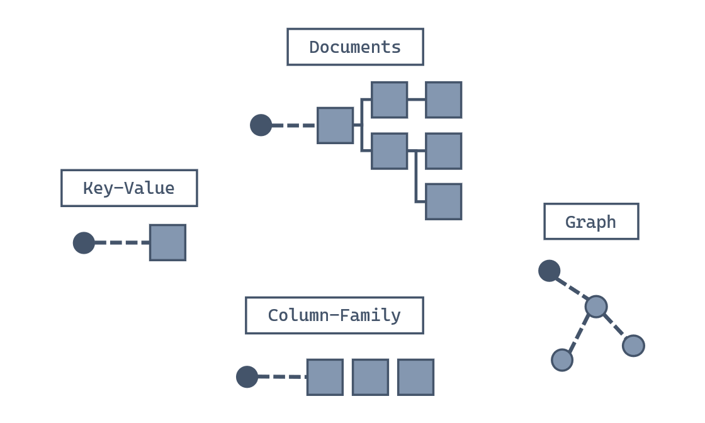
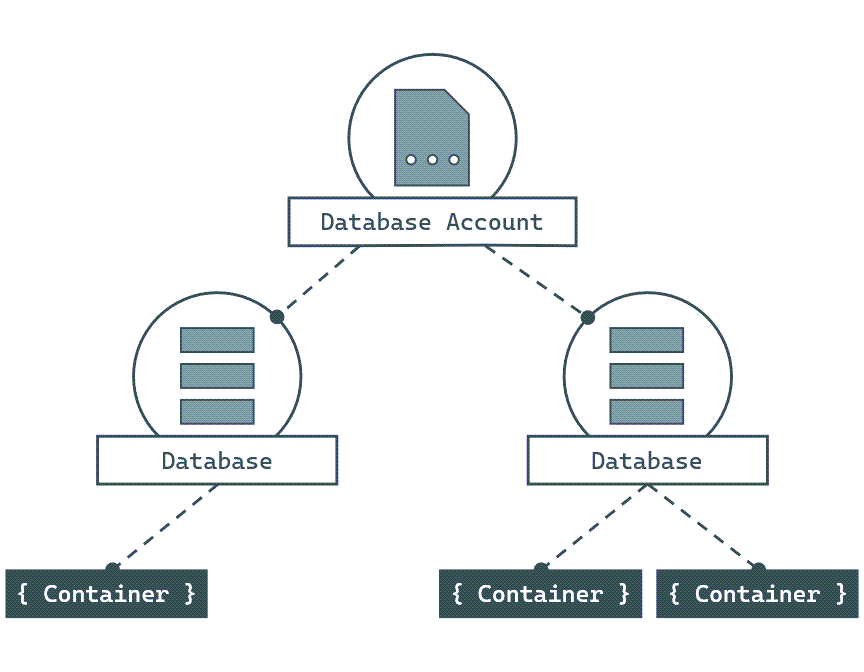

# Azure Cosmos DB


## Table of Contents
1. [Get Started with Azure Cosmos DB for NoSQL](#chapter_1)
2. [Query Azure Cosmos DB for NoSQL](#chapter_2)
4. [Define indexes in Azure Cosmos DB for NoSQL](#chapter_3)
4. [Optimize query and operation performance](#chapter_4)


## Chapter 1 - Get Started with Azure Cosmos DB for NoSQL <a name="chapter_1"></a>

### Introduction

Azure Cosmos DB is a fast NoSQL database service for modern app development at any scale.

Here, we look at how Azure Cosmos DB and its NoSQL API can be used for this type of business problem. We also learn a bit about how the database works. At the end, this module helps you decide if Azure Cosmos DB for NoSQL is a good choice for your solutions.

### What is a NoSQL database?

Developers require new kinds of databases that can address the unique challenges of modern apps. NoSQL databases were designed to address needs such as:

- High volumes of data.
- Data with many different sources and forms.
- Dynamic data schemas that store different types of data.
- Using high-velocity and/or real-time data.

You define NoSQL databases by the common characteristics they share rather than by a specific formal definition. These characteristics include:

- A nonrelational data store.
- Being designed to scale out
- Not enforcing a specific schema.

Generally, NoSQL databases don't enforce relational constraints or put locks on data, making writes fast. Also, they're often designed to horizontally scale via sharding or partitioning, which allows them to maintain high-performance regardless of size.

While there are many **NoSQL data models**, four broad data model families are commonly used when modeling data in a NoSQL database:



Moving forward, we focus on the data model supported by Azure Cosmos DB for NoSQL: The **document** data model.

### Why use a NoSQL database with the document data model?

The document data model breaks data down into individual document entities. 

A document can be any structured data type, but JSON is commonly used as the data format. The Azure Cosmos DB for NoSQL supports **JSON** natively.

### What is Azure Cosmos DB for NoSQL?

Azure Cosmos DB for NoSQL is a fast NoSQL database service that offers rich querying over diverse data. 

It helps deliver configurable and reliable performance, is globally distributed, and enables rapid development.


Azure Cosmos DB for NoSQL has a few advantages such as:

- **Guaranteed speed at any scale**—even through bursts—with instant, limitless elasticity, fast reads, and multi-master writes, anywhere in the world.
- **Fast, flexible app development** with SDKs for popular languages, a native NoSQL API along with APIs for MongoDB, Cassandra, and Gremlin, and no-ETL (extract, transform, load) analytics.
- Ready for mission-critical applications with guaranteed business continuity, **99.999-percent availability**, and **enterprise-grade security**.
- Fully managed and cost-effective **serverless database** with instant, automatic scaling that responds to application needs.

These capabilities make Azure Cosmos DB ideally suited for modern application development. Azure Cosmos DB for NoSQL is especially suited for applications that:

- Experience unpredictable spikes and dips in traffic
- Generate lots of data
- Need to deliver real-time user experiences
- Are depended upon for business continuity

The Azure Cosmos DB for NoSQL can arbitrarily store native JSON documents with flexible schema. Data is indexed automatically and is available for query using a flavor of the SQL query language designed for JSON data. The NoSQL API can be accessed using SDKs for popular frameworks such as .NET, Python, Java, and Node.js.

### What are the components of Azure Cosmos DB for NoSQL?

To begin using Azure Cosmos DB, you first create various resources in Azure such as accounts, databases, containers, and items.



#### Accounts

Accounts are the **fundamental units of distribution and high availability**. At the account level, you can configure the region[s] for your data in Azure Cosmos DB for NoSQL. Accounts also contain the globally unique DNS name used for API requests. You can also set the default consistency level for requests at the account level. You can manage or create accounts using the Azure portal, Azure Resource Manager templates, the Azure CLI, or Azure PowerShell.

#### Databases

Each account can contain one or more Databases. A database is a **logical unit of management for containers** in Azure Cosmos DB for NoSQL.

#### Containers

Containers are the **fundamental unit of scalability** in Azure Cosmos DB for NoSQL. With Azure Cosmos DB, you provision throughput at the container level. You can also optionally configure an indexing policy or a default time-to-live value at the container level. Azure Cosmos DB for NoSQL will automatically and transparently partition the data in a container.

#### Items

The NoSQL API for Azure Cosmos DB stores **individual documents in JSON format** as items within the container. Azure Cosmos DB for NoSQL natively supports JSON files and can provide fast and predictable performance because write operations on JSON documents are atomic.

### Partitioning and horizontal scaling in Azure Cosmos DB

https://learn.microsoft.com/en-us/azure/cosmos-db/partitioning-overview#choose-partitionkey

### Azure Cosmos DB Python SDK for API for NoSQL

https://learn.microsoft.com/en-us/azure/cosmos-db/nosql/sdk-python


## Chapter 2 - Query Azure Cosmos DB for NoSQL <a name="chapter_2"></a>

Azure Cosmos DB for NoSQL uses the already popular Structured Query Language (SQL) syntax to perform queries over semi-structured data. 

Here is an example of a JSON object that would be in this container:

```
{
    "id": "86FD9250-4BD5-42D2-B941-1C1865A6A65E",
    "categoryId": "F3FBB167-11D8-41E4-84B4-5AAA92B1E737",
    "categoryName": "Components, Touring Frames",
    "sku": "FR-T67U-58",
    "name": "LL Touring Frame - Blue, 58",
    "description": "The product called \"LL Touring Frame - Blue, 58\"",
    "price": 333.42,
    "tags": [
        {
            "id": "764C1CC8-2E5F-4EF5-83F6-8FF7441290B3",
            "name": "Tag-190"
        },
        {
            "id": "765EF7D7-331C-42C0-BF23-A3022A723BF7",
            "name": "Tag-191"
        }
    ]
}
```

Example query

```
SELECT
    p.name, 
    p.categoryName,
    p.price
FROM 
    products p
WHERE
    p.price >= 50 AND
    p.price <= 100
```

## Chapter 3 - Define indexes in Azure Cosmos DB for NoSQL <a name="chapter_3"></a>

### Introduction

By default, Azure Cosmos DB automatically indexes all paths of items stored using the NoSQL API.

### Indexing policy strategies

In the simplest terms, an **indexing policy is really two sets of include/exclude expressions** that are evaluated to determine which actual properties are indexed. 

By this very nature, conflicts between include and exclude paths will occur, as the existence of conflicts is by design. **When a conflict occurs, the expression with the most precision takes precedence**. For example, let’s evaluate these two include and exclude path sets:

- Included path: /category/name/?
- Excluded path: /category/*

The exclude path excludes all possible properties within the category path, however the include path is more precise and specifically includes the category.name property. The result is that all properties within category are not indexed, with the sole exception being the category.name property.

Example

```
{
  "indexingMode": "consistent",
  "automatic": true,
  "includedPaths": [
    {
      "path": "/name/?"
    },
    {
      "path": "/tags/[]/name/?"
    }
  ],
  "excludedPaths": [
    {
      "path": "/*"
    }
  ]
}
```

## Chapter 4 - Optimize query and operation performance <a name="chapter_4"></a>

### Introduction

Azure Cosmos DB for NoSQL is schema-agnostic. Out of the box, the default indexing policy includes all possible paths and values for a good balance between the thoroughness of the index and performance. You can tune the indexing policy to better match your application’s requirements as you build more complex solutions. In this module, you will explore a few common patterns for adjusting an indexing policy and the resultant index.

### Index usage

The query engine evaluates query filters and then traverses the index of your container. The query engine will automatically try to use the most efficient of the following three methods of evaluating filters:

|Method|Description|RU implication|
|-|-|-|
Index seek|The query engine will seek an exact match on a field’s value by traversing directly to that value and looking up how many items match. Once the matched items are determined, the query engine will return the items as the query result.|The RU charge is constant for the lookup. The RU charge for loading and returning items is linear based on the number of items.
|Index scan	|The query engine will find all possible values for a field and then perform various comparisons only on the values. Once matches are found, the query engine will load and return the items as the query result.|The RU charge is still constant for the lookup, with a slight increase over the index seek based on the cardinality of the indexed properties. The RU charge for loading and returning items is still linear based on the number of items returned.
|Full scan	|The query engine will load the items, in their entirety, to the transactional store to evaluate the filters.|This type of scan does not use the index; however, the RU charge for loading items is based on the number of items in the entire container.|


