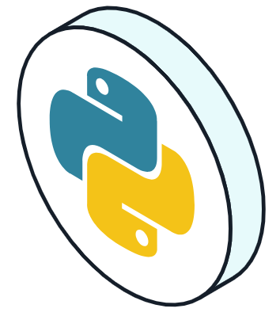
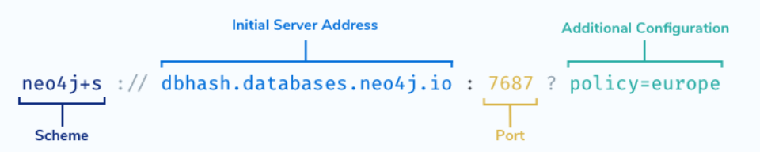

# Building Neo4j Applications with Python




## Table of Contents
1. [The Neo4j Python Driver](#chapter_1)
2. [Sessions and Transactions](#chapter_2)
3. [Processing Results](#chapter_3)
4. [The Neo4j Type System](#chapter_4)
5. [Handling Driver Errors](#chapter_5)


## Chapter 1 - The Neo4j Python Driver <a name="chapter_1"></a>

### About the Driver

To execute a Cypher statement against a Neo4j database you will use an object called a Driver.

*The **Driver** object is a thread-safe, application-wide fixture from which all Neo4j interaction derives.*

*The Driver **API** is **topology independent**, so you can run the same code against a Neo4j cluster or a single DBMS.*

To connect to and query Neo4j from within a Python application, you use the Neo4j Python Driver.

Supported languages
- Python
- Java
- Javascript
- .NET
- Go

You should create a **single instance of the Driver** in your application **per Neo4j cluster or DBMS**, which can then be shared across your application.

#### Installing the Driver

The Neo4j Python Driver is available through the pip management system and can be installed with the **pip** command.
```
pip install neo4j
```

### Creating a Driver Instance

Each driver instance will connect to one DBMS, or Neo4j cluster, depending on the value provided in the connection string.

The neo4j package exports a **GraphDatabase object**. This object provides a driver() function for creating a new driver instance.

The driver() function requires one mandatory parameter, a **connection string** for the Neo4j cluster or DBMS - for example neo4j://localhost:7687 or neo4j+s://dbhash.databases.neo4j.io:7687.

Additionally, you will also pass a named parameter **auth** to represent the Neo4j user credentials. You can provide basic username/password authentication by passing the username and password as a tuple.

Here is an example for how to create a driver instance to connect to a Neo4j instance running on localhost on port 7687 with the username neo4j and password neo:
```
# Import the neo4j dependency
from neo4j import GraphDatabase

# Create a new Driver instance
with GraphDatabase.driver(
    "neo4j://localhost:7687", 
    auth=("neo4j", "neo")
) as driver:
    # Execute code before the driver graciously closes itself
```

#### Verifying Connectivity

You can verify that the connection details used during driver instantiation are correct by calling the verifyConnectivity() function. 

This function will raise a Neo4jException with a code property of Neo.ClientError.Security.Unauthorized if a connection could not be made.

```
# Verify the connection details
driver.verify_connectivity()
```

### Connection Strings and Authentication

In the previous lesson, you saw some example code for creating a new driver instance. Let’s take a closer look at the driver() function and how it is used to create a driver instance.
```
driver = GraphDatabase.driver(
  connectionString, 
  auth=(username, password),
  **configuration 
)
```

The neo4j.driver() function accepts the following arguments:
- A **connection string**
- An **authentication** method to use when connecting - in this case, username/password authentication
- **Optionally**, you can provide **additional configuration as named parameters**

Let’s take a look at these points in more detail.

#### The Connection String

A connection string typically consists of four elements:



- The **scheme** used to connect to the Neo4j instance - for example neo4j or neo4j+s (required)
- The **initial server address** for the Neo4j DBMS - for example localhost or dbhash.databases.neo4j.io (required)
- The **port number** that the DBMS is running on (required if the instance is not running on the default port of 7687)
- **Additional connection configuration** (for example the routing context)

#### Choosing your Scheme

Most likely, you will use a variation of the neo4j scheme within your connection string.

- **neo4j** - Creates an unencrypted connection to the DBMS. If you are connecting to a local DBMS or have not explicitly turned on encryption then this is most likely the option you are looking for.
- **neo4j+s** - Creates an **encrypted connection** to the DBMS. The driver will **verify the authenticity of the certificate** and fail to verify connectivity if there is a problem with the certificate.
- **neo4j+ssc** - Creates an **encrypted connection** to the DBMS, but will **not** attempt to **verify the authenticity of the certificate**.

Variations of the **bolt scheme** can be used to **connect directly to a single DBMS** (within a clustered environment or standalone). This can be useful if you have a single server configured for data science or analytics.

- bolt - Creates an unencrypted connection directly to a single DBMS.
- bolt+s - Creates an encrypted connection directly to a single DBMS and verify the certificate.
- bolt+ssc - Creates an encrypted connection to directly to a single DBMS but will not attempt to verify the authenticity of the certificate.

##### Additional Connection Information

Additional connection information can be appended to the connection string after a ?. For example, in a multi-data centre cluster, you may wish to take advantage of locality to reduce latency and improve performance.

#### An Authentication Token

In most cases, you will connect to the DBMS using basic authentication consisting of a username and password. You can pass the username and password as a tuple to the auth parameter.
```
auth = (username, password)
```

#### Additional Driver Configuration (Optional)

The driver() function also accepts additional configuration parameters.

This object allows you to provide advanced configuration options, for example setting the connection pool size or changing timeout limits.

```
GraphDatabase.driver(
    uri, 
    auth=auth,
    max_connection_lifetime=30 * 60,
    max_connection_pool_size=50,
    connection_acquisition_timeout=2 * 60
)
```


## Chapter 2 - Sessions and Transactions <a name="chapter_2"></a>

### Sessions

Through the Driver, we open Sessions.

*A session is a **container for a sequence of transactions**. Sessions borrow connections from a pool as required and are considered lightweight and disposable.*

It is important to remember that **sessions are not the same as database connections**. When the Driver connects to the database, it opens up multiple TCP connections that can be borrowed by the session. A query may be sent over multiple connections, and results may be received by the driver over multiple connections.

Instead, **sessions** should be considered a **client-side abstraction for grouping units of work, which also handle the underlying connections**. The connections themselves are managed internally by the driver and are not directly exposed to the application.

To open a new session, call the session() method on the driver.
```
with driver.session() as session:
```

If no **database** is supplied, the default database will be used. This is configured in the dbms.default_database in neo4j.conf, the default value is neo4j. You cannot create multiple databases in Neo4j Aura or in Neo4j Community Edition.

For more information on multi-database setup, see Managing Multiple Databases.

The default **access mode** is set to write, but this can be overwritten by explicitly calling the execute_read() or execute_write() functions.

### Transactions

Through a Session, we can run one or more Transactions.

*A transaction comprises a unit of work performed against a database. It is treated in a coherent and reliable way, independent of other transactions.*

---

**ACID Transactions**

A transaction, by definition, must be **atomic**, **consistent**, **isolated**, and **durable**.

---

There are three types of transaction exposed by the driver:
- Auto-commit Transactions
- Read Transactions
- Write Transactions

#### Auto-commit Transactions

Auto-commit transactions are a single unit of work that are immediately executed against the DBMS and acknowledged immediately. You can run an auto-commit transaction by calling the **run()** method on the session object, passing in a Cypher statement as a string and optionally an object containing a set of parameters.
```
session.run(
    "MATCH (p:Person {name: $name}) RETURN p", # Query
    name="Tom Hanks" # Named parameters referenced
)
```

---

**For one-off queries only**

In the event that there are any transient errors when running a query, the driver will not attempt to retry a query when using session.run(). For this reason, these should only be used for one-off queries and should **not** be used **in production**.

---

#### Read Transactions

When you intend to **read data from Neo4j**, you should execute a Read Transaction. In a clustered environment (including Neo4j Aura), read queries are distributed across the cluster.

The session provides an **execute_read()** function, which expects a single parameter, a function that represents the unit of work. The first argument passed to the function will be a transaction object, on which you can call the run() function to execute a Cypher statement. As with the session.run example above, the first argument for the run() function should be a Cypher statement, and any parameters in the Cypher statement should be passed as named parameters.

```
# Define a Unit of work to run within a Transaction (`tx`)

def get_movies(tx, title):
    return tx.run("""
        MATCH (p:Person)-[:ACTED_IN]->(m:Movie)
        WHERE m.title = $title
        RETURN p.name AS name
        LIMIT 10
    """, title=title)


# Execute get_movies within a Read Transaction

session.execute_read(get_movies,
    title="Arthur"
)
```

You do not need to explicitly commit a read transaction.

#### Write Transactions

If you intend to write data to the database, you should execute a Write Transaction.

In clustered environments, write queries are sent exclusively to the leader of the cluster. The leader of the cluster is then responsible for processing the query and synchronising the transaction across the followers and read-replica servers in the cluster.

The process is identical to running a Read Transaction.

```
# Call tx.run() to execute the query to create a Person node

def create_person(tx, name):
    return tx.run(
        "CREATE (p:Person {name: $name})",
        name=name
    )


# Execute the `create_person` "unit of work" within a write transaction

session.execute_write(create_person, name="Michael")
```

If anything goes wrong within of the unit of work or there is a problem on Neo4j’s side, the transaction will be automatically rolled back and the database will remain in its previous state. **If** the unit of work **succeeds**, the transaction will be **automatically committed**.

Unlike session.run(), **if** a **transient error** is received by the driver, for example a connectivity issue with the DBMS, **the driver will automatically retry** the unit of work.

#### Manually Creating Transactions

It is also possible to explicitly create a transaction object by calling the **begin_transaction()** function on the session.
```
Creating an Manual Transaction
with session.begin_transaction() as tx:
    # Run queries
```

This returns a Transaction object identical to the one passed in to the unit of work function when calling execute_read() or execute_write().

This method differs from the execute_read and execute_write() functions, in that the transaction will have to be **manually committed or rolled back** depending on the outcome of the unit of work.

You can commit a transaction by calling the **tx.commit()** function, or roll back the transaction by calling **tx.rollback()**.

```
try:
    # Run a query
    tx.run(query, **params)

    # Commit the transaction
    tx.commit()
except:
    # If something goes wrong in the try block,
    # then rollback the transaction
    tx.rollback()
```

#### Closing the Session

Once you are finished with your session, you call the close() method to **release any database connections held by that session**.
```
# Close the session
session.close()
```

#### A Working Example

The following code defines a function that accepts a name parameter, then executes a write transaction to create a :Person node in the people database.

```
def create_person_work(tx, name):
    return tx.run("CREATE (p:Person {name: $name}) RETURN p",
        name=name).single()

def create_person(name):
    # Create a Session for the `people` database
    session = driver.session(database="people")

    # Create a node within a write transaction
    record = session.execute_write(create_person_work, name=name)

    # Get the `p` value from the first record
    person = record["p"]

    # Close the session
    session.close()

    # Return the property from the node
    return person["name"]
```


## Chapter 3 - Processing Results <a name="chapter_3"></a>

Query **results** are typically consumed as a **stream of records**. The drivers provide a way to iterate through that stream.

### Result

Here is an example query which retrieves a list of :Person nodes related to a given Movie.

```
# Unit of work
def get_actors(tx, movie):
    result = tx.run("""
        MATCH (p:Person)-[:ACTED_IN]->(:Movie {title: $title})
        RETURN p
    """, title=movie)

    # Access the `p` value from each record
    return [ record["p"] for record in result ]

# Open a Session
with driver.session() as session:
    # Run the unit of work within a Read Transaction
    actors = session.execute_read(get_actors, movie="The Green Mile")

    for record in actors:
        print(record["p"])

    session.close()
```

The code can be broken down into two elements:

- The **get_actors()** function defines a unit of work to be executed within a transaction, passed as the first argument of the function, in this case referenced as tx
- The **execute_read()** method executes the unit of work within a Read Transaction

The result of the execute_read() is a **Result object**.

The result object acts as a **buffer for an iterable list of records** and provides a number of options for accessing those records. **Once a result is consumed, it is removed from the buffer**.

### Peeking at Results

If you wish to **preview a result without consuming it**, you can use the peek method.
```
# Check the first record without consuming it

peek = result.peek()
print(peek)
```

This can be used to preview the **first record** in the result without removing it from the buffer.

### Keys

To get the keys for each record in the result, you can call the keys() method.
```
# Get all keys available in the result
print(result.keys()) # ["p", "roles"]
```

### Single Result

**If you only expect a single record**, you can use the single() method on the result to return the first record.

```
def get_actors_single(tx, movie):
    result = tx.run("""
        MATCH (p:Person)-[:ACTED_IN]->(:Movie {title: $title})
        RETURN p
    """, title=movie)

    return result.single()
```

If **more than one record** is available from the result then a **warning** will be generated, but the first **result will still be returned**. 

If **no results** are available, then the method call will **return None**.

### Value

If you wish to **extract a single value from the remaining list of results**, you can use the value() method.

```
def get_actors_values(tx, movie):
    result = tx.run("""
        MATCH (p:Person)-[r:ACTED_IN]->(m:Movie {title: $title})
        RETURN p.name AS name, m.title AS title, r.roles AS roles
    """, title=movie)

    return result.value("name", False)
    # Returns the `name` value, or False if unavailable
```

This method expects two parameters:
- The **key** of the field to return for each remaining record, and returns a list of single values.
- **Optionally**, you can provide a **default value** to be used if the value is None or unavailable.

### Values

If you need to extract more than one item from each record, use the values() method. 

The method expects **one parameter per item requested from the RETURN statement of the query**.

```
def get_actors_values(tx, movie):
    result = tx.run("""
        MATCH (p:Person)-[r:ACTED_IN]->(m:Movie {title: $title})
        RETURN p.name AS name, m.title AS title, r.roles AS roles
    """, title=movie)

    return result.values("name", "title", "roles")
```

In the above example, a list will be returned, with each entry containing values representing name, title, and roles.

Consume
The consume() method will **consume the remainder** of the results and **return a Result Summary**.

```
def get_actors_consume(tx, name):
    result = tx.run("""
        MERGE (p:Person {name: $name})
        RETURN p
    """, name=name)

    info = result.consume()
```

The Result Summary contains a information about the server, the query, execution times and a counters object which provide statistics about the query.

The counters object can be used to retrieve the number of nodes, relationships, properties or labels that were affected during a write transaction.
```
print("{0} nodes created".format(info.counters.nodes_created))

print("{0} properties set".format(info.counters.properties_set))
```

You can read more about the result summary here https://neo4j.com/docs/api/python-driver/4.4/api.html#neo4j.ResultSummary


## Chapter 4 - The Neo4j Type System <a name="chapter_4"></a>

At this point, we should take a look at the Cypher type system. As **Neo4j is written in Java** (the j in Neo4j stands for Java after all), there are some discrepancies between the types stored in the Neo4j database and native Python types.

Some values like strings, floats, booleans, and nulls map directly to Python types, but more complex types need special handling.

| Python Type | Neo4j Cypher Type |
|-|-|
| None | null |
| bool | Boolean |
| int | Integer |
| float | Float |
| str | String |
| bytearray | Bytes [1] |
| list | List |
| dict | Map |
| neo4j.spatial.Point | Point |
| neo4j.spatial.CartesianPoint | Point (Cartesian) |
| neo4j.spatial.WGS84Point | Point (WGS-84) | 
| neo4j.graph.Node | Node |
| neo4j.graph.Relationship | Relationship |
| neo4j.graph.Path | Path |

For more information about *Temporal Data Types* -> https://graphacademy.neo4j.com/courses/app-python/2-interacting/3-type-system/#_temporal_data_types

### Nodes & Relationships

Nodes and Relationships are both returned as similar classes.

As an example, let’s take the following code snippet:
```
result = tx.run("""
MATCH path = (person:Person)-[actedIn:ACTED_IN]->(movie:Movie {title: $title})
RETURN path, person, actedIn, movie
""", title=movie)
```

The query will return one record for each :Person and :Movie node with an :ACTED_IN relationship between them.

#### Nodes

We can retrieve the movie value from a record using the [] brackets method, providing a string that refers to the alias for the :Movie node in the Cypher statement.
```
for record in result:
    node = record["movie"]
```

The value assigned to the node variable will be the instance of a Node. Node is a type provided by the Neo4j Python Driver to hold the information held in Neo4j for the node.
```
print(node.id)     
print(node.labels) 
print(node.items())

print(node["name"])
print(node.get("name", "N/A"))
```

- The id property provides access to the node’s **Internal ID**
    - eg. 1234
- The **labels** property is a frozenset containing an **array of labels** attributed to the Node
    - eg. ['Person', 'Actor']
- The **items()** method provides access to the node’s properties as an **iterable of all name-value pairs**.
    - eg. {name: 'Tom Hanks', tmdbId: '31' }
- A single property can be retrieved by either using **[] brackets** or using the **get() method**. The get() method also allows you to define a **default** property if none exists.

---

*Internal IDs*

Internal IDs refer to the position in the Neo4j store files where the record is held. These numbers can be re-used, a **best practice** is to always **look up a node by an indexed property rather than relying on an internal ID**.

---

#### Relationships

Relationship objects are similar to a Node in that they provide the same method for accessing the internal ID and properties.
```
acted_in = record["actedIn"]

print(acted_in.id)     
print(acted_in.type)   
print(acted_in.items())

print(acted_in["roles"])
print(acted_in.get("roles", "(Unknown)"))

print(acted_in.start_node)
print(acted_in.end_node)  
```

- **start_node** - an integer representing the internal ID for the node at the start of the relationship
- **end_node** - an integer representing the internal ID for the node at the end of the relationship

#### Paths

If you return a path of nodes and relationships, they will be returned as an instance of a Path.
```
path = record["path"]

print(path.start_node)   
print(path.end_node)     
print(len(path))         
print(path.relationships)
```

- **len(path)** - A count of the number of relationships within the path
- **relationships** - An array of Relationship objects within the path.

##### Path Segments

**A path is split into segments representing each relationship in the path**. 

For example, say we have a path of (p:Person)-[:ACTED_IN]→(m:Movie)-[:IN_GENRE]→(g:Genre), there would be two relationships.
- (p:Person)-[:ACTED_IN]→(m:Movie)
- (m:Movie)-[:IN_GENRE]→(g:Genre)

The **relationships within a path** can be iterated over using the **iter()** function.
```
for rel in iter(path):
    print(rel.type)
    print(rel.start_node)
    print(rel.end_node)
```

### Temporal Data Types

Temporal data types are implemented by the neo4j.time module.

It provides a set of types compliant with ISO-8601 and Cypher, which are similar to those found in the built-in datetime module. Sub-second values are measured to nanosecond precision and the types are compatible with pytz.

The table below shows the general mappings between Cypher and the temporal types provided by the driver.

In addition, the built-in temporal types can be passed as parameters and will be mapped appropriately.

| Neo4j Cypher Type | Python driver type | Python built-in type |
|-|-|-|
| Date | neo4j.time.Date | datetime.date |
| Time | neo4j.time.Time | datetime.time (TimeZone provided) |
| LocalTime | neo4j.time.Time | datetime.time |
| DateTime | neo4j.time.DateTime |datetime.datetime (TimeZone provided) |
| LocalDateTime | neo4j.time.DateTime | datetime.datetime |
| Duration | neo4j.time.Duration | datetime.timedelta |

```
# Create a DateTime instance using individual values
datetime = neo4j.time.DateTime(year, month, day, hour, minute, second, nanosecond)

#  Create a DateTime  a time stamp (seconds since unix epoch).
from_timestamp = neo4j.time.DateTime(1609459200000) # 2021-01-01

# Get the current date and time.
now = neo4j.time.DateTime.now()

print(now.year) # 2022
```

Each of the above types has a number of attributes for accessing the different, for example year, month, day, and in the case of the types that include a time, hour, minute and second.

For more information -> https://neo4j.com/docs/api/python-driver/4.4/temporal_types.html

### Spatial Data Types

Cypher has built-in support for handling spatial values (points), and the underlying database supports storing these point values as properties on nodes and relationships.

| Cypher Type | Python Type |
|-|-|
| Point | neo4j.spatial.Point |
| Point (Cartesian) | neo4j.spatial.CartesianPoint |
| Point (WGS-84) | neo4j.spatial.WGS84Point |

#### CartesianPoint

A Cartesian Point can be created in Cypher by **supplying x and y values** to the point() function. The **optional z** value represents the height.

To create a Cartesian Point in Python, you can import the neo4j.spatial.CartesianPoint class.
```
# Using X and Y values
twoD=CartesianPoint((1.23, 4.56))
print(twoD.x, twoD.y)

# Using X, Y and Z
threeD=CartesianPoint((1.23, 4.56, 7.89))
print(threeD.x, threeD.y, threeD.z)
```
For more information, see the Python reference -> https://neo4j.com/docs/api/python-driver/current/api.html#cartesianpoint


#### WGS84Point

A WGS84 Point can be created in Cypher by supplying **latitude and longitude** values to the point() function. To create a Cartesian Point in Python, you can import the neo4j.spatial.WGS84Point class.
```
london=WGS84Point((-0.118092, 51.509865))
print(london.longitude, london.latitude)

the_shard=WGS84Point((-0.086500, 51.504501, 310))
print(the_shard.longitude, the_shard.latitude, the_shard.height)
```

For more information, see the Python reference -> https://neo4j.com/docs/api/python-driver/current/api.html#wgs84point

#### Distance

When using the point.distance function in Cypher, the distance calculated between two points is **returned as a float**.
```
WITH point({x: 1, y:1}) AS one,
     point({x: 10, y: 10}) AS two

RETURN point.distance(one, two) // 12.727922061357855
```


## Chapter 5 - Handling Driver Errors <a name="chapter_5"></a>

When executing a Cypher statement, certain exceptions and error cases may arise. 

One error could be a **transient** error that may be resolved if retried, for example a problem connecting to the database instance. Another type of error could be something more **permanent**, for example a Syntax Error or a Constraint Error.

In the Neo4j Python Driver, an error extending the neo4j.exceptions.Neo4jError class will be thrown.

### Exception Types

Depending on the nature of the error, you may receive one of the following exceptions:

- neo4j.exceptions.**Neo4jError** - Raised when the Cypher engine returns an error to the client.
-  neo4j.exceptions.**ClientError** - The Client sent a bad request - changing the request might yield a successful outcome.
- neo4j.exceptions.**CypherSyntaxError** - Raised when the Cypher statement contains one or more syntax errors
- neo4j.exceptions.**CypherTypeError** - Raised when or more of the data types in the query is incorrect
- neo4j.exceptions.**ConstraintError** - Raised when action is rejected due to a constraint violation
- neo4j.exceptions.**AuthError** - Raised when authentication failure occurs.
- neo4j.exceptions.**Forbidden** - Raised when the action is forbidden for the authenticated user
- neo4j.exceptions.**TransientError** - The database cannot service the request right now, retrying later might yield a successful outcome
- neo4j.exceptions.**ForbiddenOnReadOnlyDatabase** - The write cypher you are requesting cannot be run on a readonly database
- neo4j.exceptions.**NotALeader** - The write query cannot be executed on the current server because it is not the leader of the cluster

You can catch the specific exception above within a try/catch block, or catch all Neo4jErrors instances:
```
# Import the Exception classes from neo4j.exceptions
from neo4j.exceptions import Neo4jError, ConstraintError

# Attempt a query
try:
    tx.run(cypher, params)
except ConstraintError as err:
    print("Handle constaint violation")
    print(err.code)   
    print(err.message)
except Neo4jError as err:
    print("Handle generic Neo4j Error")
    print(err.code)   
    print(err.message)
```

#### Error Codes

The Neo4jError includes a code property, which provides higher-level information about the query.

Each status code follows the same format, and includes four parts:
```
Neo.[Classification].[Category].[Title]
```

- Every Neo4j Error code is prefixed with Neo.
- The Classification provides a high-level classification of the error - for example, a client-side error or an error with the database.
- The Category provides a higher-level category for the error - for example, a problem with clustering, a procedure or the database schema.
- The Title provides specific information about the error that has occurred.

