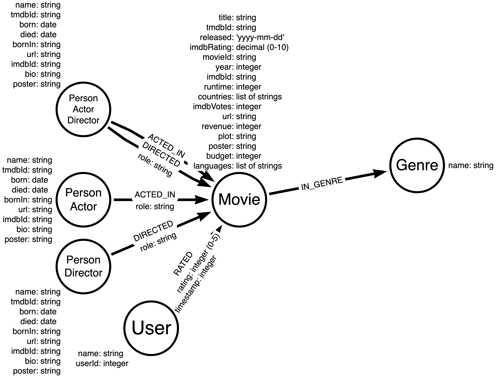

# Cypher Indexes and Constraints


## Table of Contents
1. [Indexes and Constraints in Neo4j](#chapter_1)
2. [Using Constraints in Neo4j](#chapter_2)
3. [Using Indexes in Neo4j](#chapter_3)
4. [Using Full-text Indexes in Neo4j](#chapter_4)


## Chapter 1 - Indexes and Constraints in Neo4j
 <a name="chapter_1"></a>

### Constraints and Indexes in Neo4j

#### Constraints in Neo4j

A constraint is **implemented internally as an index** and is used to constrain what is added to the graph. There are three types of constraints you can define:
- **Uniqueness** for a single node property value.
- **Existence** for a property of a node or relationship.
- Existence and uniqueness for a set of node property values (called a Node key).

A best practice is to create constraints **before you load your data**.

#### Indexes in Neo4j

An index in Neo4j is a data structure that allows the graph engine to **retrieve data quickly**. All indexes in Neo4j require **more storage** in the graph, so you must ensure that you do not index everything!

After the data is loaded, you create indexes to make your **queries perform faster**. Using indexes **makes writing data slower**, but retrieving it faster.

The **types** of indexes in Neo4j include:
- RANGE
- LOOKUP
- TEXT
- POINT
- Full-text

You can create an index on **multiple properties** or relationships. This type of index is called a **Composite index**.

### Identifying What Constraints and Indexes to Create

#### Data model for this course

Here is the graph data model:



The **node labels** for the graph include:
- Person
- Actor
- Director
- Movie
- Genre
- User

The **relationships** for the graph include:
- ACTED_IN (with an optional role property)
- DIRECTED (with an optional role property)
- RATED (with rating and timestamp properties)
- IN_GENRE

Also notice that the nodes have a number of properties, along with the type of data that will be used for each property.

#### Step 1: Identify constraints

You use constraints to:
- Uniquely identify a node.
- Ensure a property exists for a node or relationship.
- Ensure a set of properties is unique and exists for a node (Node key).

##### Uniqueness constraints

You analyze the data requirements for the application and determine how each node will be uniquely identified. In our Movie graph, we will define uniqueness constraints for these node labels:
- Movie nodes use *movieId*.
- Person nodes use *tmdbId*.
- User nodes use *userId*.
- Genre nodes use *name*.

##### Existence constraints

Depending on how data is loaded or updated in the graph, you may want to further constrain that specific properties must exist for nodes or relationships. These constraints are separate from the uniqueness constraints.

For example, you may want to enforce that every role property of the ACTED_IN relationship must have a value. Or that a Person node must have a value for the name property.

##### Node key constraints

In addition, there may be a combination of property values for a node that you want to ensure exist and are unique for every node with that label.

For example, there cannot be two Movie nodes in the graph that have the same title and year.

#### Step 2: Create constraints

Next you create the constraints per your analysis.

#### Step 3: Load the data

You typically load the data for your application and ensure that all data loaded correctly adhering to the constraints defined. If a constraint is violated, the Cypher load will fail.

A best practice is to always use **MERGE** for creating nodes and relationships. MERGE first does a lookup (using the uniqueness constraint which is an index), then creates the node if it does not exist.

You can use **LOAD CSV** to load data or you can use the Neo4j Data Importer App. The Neo4j Data Importer App actually creates the uniqueness constraints for you.

#### Step 4: Identify indexes

Identifying the indexes for your graph depends on the most **important use cases (queries) of your application**.

For example, if this is an important query in your application:
```
MATCH (p:Person)-[:ACTED_IN]->(m)
WHERE p.name = $aName
RETURN m.title
```

The anchor of the query is the Person node with a specific name value. This query can benefit from a **RANGE index on the name property**.

But if your important query is the following:
```
MATCH (p)-[:ACTED_IN]->(m:Movie)
WHERE m.title CONTAINS $titleSubString
RETURN p.name, m.title
```

The anchor of the query is the **title** property of Movie nodes. The test is **CONTAINS**. A RANGE index will help this query, but a **TEXT index** will perform better.

Through the remainder of this course, you will have an opportunity to create and use constraints and indexes.

#### Step 5: Create indexes

After you have loaded the data and identified the indexes you will need, you create the indexes.

As you test your application, an important part is testing the performance of the queries. Use cases for the application may change so the identifying and creating indexes to improve query performance will be an ongoing process during the lifecycle of your application.


## Chapter 2 - Using Constraints in Neo4j
 <a name="chapter_2"></a>

### Constraints in Neo4j

A constraint is implemented internally as an index. It is used to constrain what is added to the graph. There are three types of constraints you can define:
- **Uniqueness** for a single node property value or a set of node property values.
- **Existence** for a property of a node or relationship.
- Existence and uniqueness for a node property value or a set of node property values (Node key).

#### Uniqueness constraints

A uniqueness constraint **can be defined for a property of a node with a given label**.

For example, in the Movie graph, we uniquely identify every Person node. To do this, we identify a property whose value will be unique for all nodes with the Person label.

Execute this query that returns all Person nodes for a person named Austin Green:
```
MATCH (p:Person)
WHERE p.name = 'Austin Green'
RETURN p
```

This query returns two Person nodes for two different people. Their names are the same, but their tmdbId values (and other property values) are different. In our Movie graph, the tmdbId value for every Person node is unique.

If we define a uniqueness constraint on a property for a labeled node, an **error is raised** if we attempt to create another labeled node with the same property value or if we set the value of an existing node property to a value that already exists in the graph.

---
*Best Practices*

A graph data modeling best practice is to always uniquely identify a node with a given label in the graph where a node will typically represent the business entities in your application.

---

##### Uniqueness constraint is an index

Neo4j implements a uniqueness constraint as an index. It is used to quickly look up a node by a property value to determine if it is unique for the graph.

For this reason, this Cypher code will execute very quickly when a uniqueness constraint is defined. You can execute this code:
```
MERGE (p:Person {tmdbId: '135067'})
ON CREATE
SET p.name = 'Austin Green',
    p.imdbId = '0337619',
    p.url = 'https://themoviedb.org/person/135067'
ON MATCH
SET p.updated = date()
RETURN p
```

In our graph, this node exists. The uniqueness constraint ensures that you cannot create a node with the same property value. For example, the below code will return an error.
```
CREATE (p:Person {tmdbId: '135067'})
SET p.name = 'Austin Green',
    p.imdbId = '0337619',
    p.url = 'https://themoviedb.org/person/135067'
RETURN p
```

The uniqueness constraint will catch the error and prevent the node from being created.

#### Existence constraints

An existence constraint for a node label or relationship type property means that a **property must exist**. 

*Even though, by default, you need not create all nodes or relationships with the same property keys, your graph data model may benefit from requiring that a particular property key exists.*

For example, in the Movie graph, we want to enforce that all Person nodes have a name property with a value. Remember that a node with a property with a null value is the same as that node not having that property.

**You can create an existence constraint for a node label or relationship type property**. When the node or relationship is created or updated, it must have that property with a value, otherwise and error is raised.

Suppose we had an existence constraint for the updated property for the Person nodes. If we were to execute this code. It first looks for the Person node and does not find it. Then it executes the ON CREATE clause. It will fail because the Person node has an existence constraint whereby any Person node must have the updated property, else an error is returned.
```
MERGE (p:Person {tmdbId: '999999'})
ON CREATE
SET p.name = 'Humpty Dumpty',
    p.imdbId = '999999',
    p.url = 'https://themoviedb.org/person/999999'
ON MATCH
SET p.updated = date()
RETURN p
```

#### Node key constraint

A node key is a specialized type of constraint in the graph that enables you to define a set of properties for a node label that must:

- Exist for all nodes with that label.
- Be unique for all values.

For example, suppose you want to ensure that all Person nodes in the graph have unique values for Person.name and Person.tmdbId. 

The constraint would prevent more than one Person node to exist in the graph with this combination of values. 

In addition to enforcing uniqueness and existence, this type of constraint is very efficient for looking up data where multiple property values are tested.

### Creating Uniqueness Constraints

#### Uniqueness constraints

A best practice is to identify a property for all nodes in the graph that make them unique. In our movie graph, these constraints are:
- Movie nodes use *movieId*.
- Person nodes use *tmdbId*.
- User nodes use *userId*.
- Genre nodes use *name*.

#### Syntax for creating a uniqueness constraint for a single property

```
CREATE CONSTRAINT <constraint_name> IF NOT EXISTS
FOR (x:<node_label>)
REQUIRE x.<property_key> IS UNIQUE
```

You specify the name of the constraint, the node label it will be associated with, and the name of the property.

- If a constraint already exists in the graph with the same name, no constraint is created.
- If a constraint does not exist in the graph with the same name:
    - No constraint is created if there already is a uniqueness constraint for that node label and property key.
    - Otherwise, the constraint is created.

#### Creating the uniqueness constraint for a single property

```
CREATE CONSTRAINT Movie_movieId_unique IF NOT EXISTS
FOR (x:Movie)
REQUIRE x.movieId IS UNIQUE
```

This code creates the uniqueness constraint named Movie_movieId_unique. It is always a best practice to name constraints.

#### Syntax for creating a uniqueness constraint for multiple properties

```
CREATE CONSTRAINT <constraint_name> IF NOT EXISTS
FOR (x:<node_label>)
REQUIRE (x.<property_key1>, x.<property_key2>)  IS UNIQUE
```

This constraint ensures that a set of values for a node’s properties will be unique.

#### Creating the uniqueness constraint for multiple properties

```
CREATE CONSTRAINT Movie_released_title_unique IF NOT EXISTS
FOR (x:Movie)
REQUIRE (x.released,x.title) IS UNIQUE
```

#### Listing constraints in the graph

You can view the existing constraints in the graph as follows:

```
SHOW CONSTRAINTS
```

#### Uniqueness in node creation

In our graph, we already have a Movie with the movieId of "1". Try to execute this code to create a Movie node with the same value for movieId:

```
MERGE (m:Movie {movieId: '1'})
```

This code does not modify the graph. It first finds the Movie node with this value for movieId and because the node already exists, does not create the node.

#### Uniqueness constraint creation failure

Suppose we have already loaded our data into the graph and we want to create a uniqueness constraint. In the previous example, our data is clean and we know that the Movie.movieId values in the graph are unique. Because the values are unique, the creation of the constraint was successful.

What if we are unsure if the property values for a node are unique? If we attempt to create a uniqueness constraint on a property that is not unique for all nodes with that label, the constraint creation will fail.

Execute this code that attempts to create a uniqueness constraint on the Movie.year property:
```
CREATE CONSTRAINT Movie_year_unique IF NOT EXISTS
FOR (x:Movie)
REQUIRE x.year IS UNIQUE
```

This code will fail because the values for the year property are not unique across all Movie nodes.

### Creating Existence Constraints for Node Properties

#### Existence constraints for nodes

Depending on your application needs, you may want to ensure that some nodes with a given label always have a particular property. For example, a Person node must have a name property.

---

*Enterprise Edition Only Feature*

Existence constraints are only available in Enterprise Edition.

---

#### Syntax for creating an existence constraint on a node

```
CREATE CONSTRAINT <constraint_name> IF NOT EXISTS
FOR (x:<node_label>)
REQUIRE x.<property_key>  IS NOT NULL
```

You specify the name of the constraint, the node label it will be associated with, and the name of the property that must exist for nodes with that label.
- If a constraint already exists in the graph with the same name, no constraint is created.
- If a constraint does not exist in the graph with the same name:
    - No constraint is created if there already is an existence constraint for that node label and property key.
    - Otherwise, the constraint is created.

### Creating Existence Constraints on Relationship Properties

#### Existence constraints for relationship properties

You may want to ensure that some relationship types always have a particular property. For example, a RATED relationship must have a property, rating.

---

*Enterprise Edition Only*

Existence constraints are only available in Enterprise Edition.

---

#### Syntax for creating an existence constraint for a relationship

Here is the syntax for creating an existence constraint on a relationship property:

```
CREATE CONSTRAINT <constraint_name> IF NOT EXISTS
FOR ()-[x:<RELATIONSHIP_TYPE>]-()
REQUIRE x.<property_key> IS NOT NULL
```

You specify the name of the constraint, the relationship type it will be associated with, and the name of the property that must exist for relationships of that type.
- If a constraint already exists in the graph with the same name, no constraint is created.
- If a constraint does not exist in the graph with the same name:
    - No constraint is created if there already is an existence constraint for that relationship type and property key.
    - Otherwise, the constraint is created.

### Creating Node Key Constraints

### Node key
A Node key is a specialized type of constraint for the properties of a node. It combines existence with uniqueness.

For example, a Person node’s tmdbId value must be unique and exist.

--- 

*Enterprise Edition Only*

Node key constraints are only available in Enterprise Edition.

--- 

#### Syntax for creating a Node key constraint for a single property

Here is the syntax for creating a Node key constraint for a single property:

```
CREATE CONSTRAINT <constraint_name> IF NOT EXISTS
FOR (x:<node_label>)
REQUIRE x.<property_key> IS NODE KEY
```

You specify the name of the constraint, the node label it will be associated with, and the name of the property.
- If a constraint already exists in the graph with the same name, no constraint is created.
- If a constraint does not exist in the graph with the same name:
    - No constraint is created if there already is a Node key constraint for that node label and property key.
    - Otherwise, the constraint is created.

### Managining Constraints in Neo4j

#### Managing constraints

Managing constraints in the graph includes:

- **Creating** constraints
- **Listing** constraints
    ``` 
    SHOW CONSTRAINTS
    ```
- **Dropping** constraints 
    ``` 
    DROP CONSTRAINT <constraint_name>
    ```

## Chapter 3 - Using Indexes in Neo4j
 <a name="chapter_3"></a> 

### Indexes in Neo4j

#### Indexes in Neo4j

An index in Neo4j is a data structure that allows the graph engine to retrieve data quickly. All indexes in Neo4j require more storage in the graph, so you must ensure that you do not index everything!

You learned in the previous module that a best practice is to create uniqueness constraints before you load your data. After the data is loaded, you create additional indexes to make your queries perform faster. Using indexes makes writing data slower, but retrieving it faster.

Uniqueness constraints are implemented as indexes, but there are more types of indexes that you can create and use:
- RANGE
- Composite
- TEXT
- POINT
- Full-text

---

Full-text indexes are used differently from other indexes and will be covered in the next module.

This course does not currently cover POINT indexes.

---

#### Using PROFILE to analyze queries that use indexes

At runtime, only one index is used by default.

One can PROFILE queries to:
- Identify which index is used for a query.
- Determine if adding an index improves query performance.

#### RANGE indexes
A **b-tree** is a common implementation of an index that enables you to **sort values**. 

A RANGE index in Neo4j is a proprietary implementation of a b-tree. You can define a RANGE index on a property of a node label or relationship type. The **data** stored in the index **can be any type**.

A RANGE index can speed up the following in your Cypher code:
- **Equality** checks =
    - Note: For string properties, a TEXT index may perform better.
- **Range** comparisons >,>=,<, <=
- **STARTS WITH string** comparisons
    - Note: TEXT indexes can be used for STARTS WITH comparisons but may not perform as well as RANGE indexes.
- **Existence** checks IS NOT NULL

---

ENDS WITH ands CONTAINS comparisons may benefit slightly from a RANGE index, but we recommend you use a TEXT index for these types of comparisons.

---

This query could benefit from a RANGE index in the graph for the born property associated with the Person label:

```
MATCH (p:Person)
WHERE p.born IS NOT NULL
RETURN p
```

#### Composite indexes

A composite index **combines values from multiple properties for a node label or for relationship type**. You create composite indexes when multiple properties are always tested together in a query. The types of the properties need not be the same.

*During query planning, at most one index is used, so it is beneficial in some cases to create a composite index when multiple properties need to be retrieved quickly*.

For example, you might want to index on the Movie.year and the Movie.title properties. If you created a composite index on these two properties, then this query would perform better:

```
MATCH (m:Movie) WHERE m.year > 1999
AND m.title CONTAINS "Toy"
RETURN m.title, m.year, m.imdbRating
```

#### TEXT indexes

A TEXT index supports node or relationship property types that must be **strings**.

A TEXT index can speed up the following in your Cypher code:

- **Equality** checks =
- String comparisons **ENDS WITH, CONTAINS**
- **List membership** x.prop in ["a","b","c"]

#### About LOOKUP indexes

There are two types of LOOKUP indexes in a Neo4j database. These indexes are created automatically for you and are used to **look up a node label or relationship type value**.

Without these indexes queries would need to scan the entire set of nodes or relationships for some queries which is very inefficient.

You should **not create or remove** these types of indexes in the database as they are **automatically created for you**.

### Syntax for Creating Indexes

Same as for creating a CONSTRAINT, just need to replace that word with INDEX, and replace REQUIRE with ON, without any specified value.

Below, an example:
```
CREATE TEXT INDEX Movie_plot_text IF NOT EXISTS 
FOR (x:Movie) ON (x.plot)
```


## Chapter 4 - Using Full-text Indexes in Neo4j
 <a name="chapter_4"></a>

### Full-text Indexes in Neo4j

#### Full-text indexes

Full-text indexes are useful in applications that must parse property values for evaluating whether the property satisfies the criteria. Full-text indexes rely on **Apache Lucene** for their implementation which makes their parsing capabilities very powerful.

With a full-text index, you can use Lucene’s full-text query language to express how the values will be matched in a query. A full-text index can be defined for multiple labels and/or properties, or for multiple relationship types and/or properties.

*Unlike RANGE and TEXT indexes, you must call a procedure to use a full-text index at runtime. That is, the query planner will not automatically use a full-text index unless you specify it in your Cypher code.*

#### Why use a full-text index?

Suppose you want to find all Movies that have certain phrases in their plots.

And suppose we added a TEXT index for the plot property:
```
CREATE TEXT INDEX Movie_plot_text IF NOT EXISTS 
FOR (x:Movie) ON (x.plot)
```

Performing this type of retrieval using RANGE or TEXT indexes could be very expensive. For example:
```
PROFILE MATCH (m:Movie)
WHERE m.plot CONTAINS "murder"
AND m.plot CONTAINS "drugs"
RETURN m.title,m.plot
```

The default behavior in Neo4j is to use only one index for a query. A subquery can use an additional index. But for this query, the query engine needs to determine which predicate will be more efficient. The first predicate returns all "murder" rows. The second predicate returns all "drugs" rows. For our dataset, the graph engine uses the index to select all properties that contain "drugs". It can do so because it can determine using the data in the index, that the number of the rows that contain "drugs" is smaller than the number of rows that contain "murder". For those rows, the query engine, then tests the properties for "murder". That is, the index can only be used once for this query.

When using a full-text index, you can specify an expression that will find all properties that contain both strings, anywhere in them. For example, if we had a full-text index on the Movie plot property named Movie_plot_ft, we could return the nodes that have both "murder" and "drugs" in them with this code:
```
CALL db.index.fulltext.queryNodes
('Movie_plot_ft', 'murder AND drugs')
YIELD node
```

This query uses Lucene’s full-text query language to retrieve the nodes.

Another benefit of creating a full-text index is that you can specify an index on multiple properties associated with multiple labels.

### Creating and Using Full-text Indexes

#### Full-text indexes in Neo4j

In many cases, a full-text index will help improve the performance of queries where the predicates test complex patterns in string properties. For example:
- All movie titles that contain "Night" followed by "Sky" later in the title.
- All movie plots that have "murder" but not "drugs" in them.
- All movie titles that contain "Night" and "Dead", with a plot that contains "French".

You use the CREATE clause to create a full-text index, but what makes **full-text indexes** different from other index types (RANGE, TEXT), is that they **are not automatically used in your Cypher queries**. You must call a special procedure, *db.index.fulltext.queryNodes()* to query node properties using the index. And you call *db.index.fulltext.queryRelationships()* to query relationship properties using the index.

#### Syntax for creating a full-text index for a node property

```
CREATE FULLTEXT INDEX <index_name> IF NOT EXISTS
FOR (x:<node_label>)
ON EACH [x.<property_key>]
```

You specify the name of the index, the node label it will be associated with, and the name of the property.
- If an index already exists in the graph with the same name, no index is created.
- If an index does not exist in the graph with the same name:
    - No full-text index is created if there already is a full-text index for that node label and property key.
    - Otherwise, the full-text index is created.

#### Creating the full-text index for the plot property of a Movie node

```
CREATE FULLTEXT INDEX Movie_plot_ft IF NOT EXISTS
FOR (x:Movie)
ON EACH [x.plot]
```

#### Querying with the full-text index

Unlike RANGE and TEXT indexes that are automatically used at runtime, you must explicitly call the procedure that uses the full-text index. 

When you call the procedure to query using the full-text index, you use the Lucene query to retrieve the nodes.

```
CALL db.index.fulltext.queryNodes
("Movie_plot_ft", "murder AND drugs")
YIELD node
RETURN node.title, node.plot
```

#### Syntax for creating a full-text index for a relationship property

```
CREATE FULLTEXT INDEX <index_name> IF NOT EXISTS
FOR ()-[x:<RELATIONSHIP_TYPE>]-()
ON EACH [x.<property_key>]
```

#### Syntax for querying relationships with the full-text index

```
CALL db.index.fulltext.queryRelationships
("<index_name>", "<lucene_query>")
YIELD relationship
RETURN relationship.<property>
```

