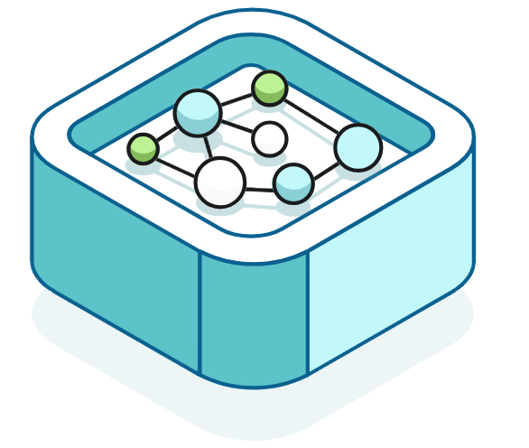
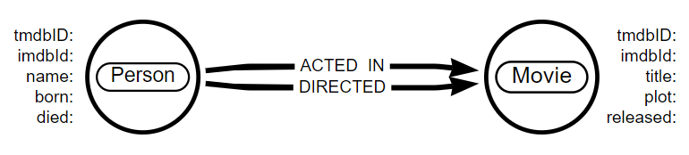
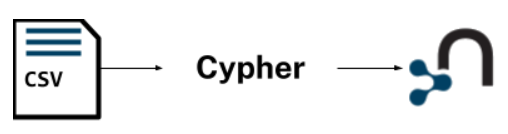

# Importing CSV data into Neo4j




## Table of Contents
1. [Importing Data](#chapter_1)
2. [Creating Nodes, Properties, and Relationships](#chapter_2)
3. [Data Types, Lists, and Labels](#chapter_3)
4. [Importing data considerations](#chapter_4)


## Chapter 1 - Importing Data <a name="chapter_1"></a>

### Getting started

In this course, we will see how to create a graph database of movies from a set of CSV files.



We will build an import process using Cypher, to create the nodes, relationships, and properties.



### The Data Import Process

#### Source data

When you import data into Neo4j, you typically start with a set of source files.

You may have exported this source data from:
- Relational databases
- Web APIs
- Public data directories
- BI tools
- Speadsheets (e.g. Excel or Google Sheets)

---

*Export to CSV*

Most data systems will have an option for exporting data to CSV files as it is a common format for data exchange

---

The data in the source files may not be in the format needed for your graph data model:
- The source files could contain more data than you need.
- There may not be a 1-1 mapping of the data in a CSV file to a node or relationship.
- The data types might not map directly onto those supported in Neo4j.

Likely, you will need to transform the data before or during the import.

#### Create a graph

Before you start the import process, you should:

- Understand the data in the source CSV files.
- Inspect and clean (if necessary) the data in the source data files.
- Understand the graph data model you will be implementing during the import.

Before you import data into Neo4j, there is no data structure, only the database itself - as you import data, you create the graph data model.

Once you have the source data and a graph data model, you can create the graph by importing the data.

---

*Data mapping*

You may find it useful to create a mapping document that shows how the source data maps to the graph data model.

---

The import involves creating Cypher code to:
- Read the source data.
- Transform the data as needed.
- Create nodes, relationships, and properties to create the graph.

Creating an import process will likely require multiple iterations as you build, test, and refactor.

### Loading CSV files

#### LOAD CSV

The LOAD CSV Cypher clause reads data from a CSV file and returns the rows in the file.

LOAD CSV has the following syntax:
```
LOAD CSV [WITH HEADERS] 
FROM url [AS alias] 
[FIELDTERMINATOR char]
```

Example:
```
LOAD CSV WITH HEADERS
FROM 'https://data.neo4j.com/importing-cypher/people.csv'
as row
RETURN count(row)
```


## Chapter 2 - Creating Nodes, Properties, and Relationships <a name="chapter_2"></a>

### Nodes

#### Load the CSV file

Once you run the below Cypher statement
```
LOAD CSV WITH HEADERS
FROM 'https://data.neo4j.com/importing-cypher/persons.csv' AS row
MERGE (p:Person {tmdbId: toInteger(row.person_tmdbId)})
SET
    p.imdbId = toInteger(row.person_imdbId),
    p.bornIn = row.bornIn,
    p.name = row.name,
    p.bio = row.bio,
    p.poster = row.poster,
    p.url = row.url,
    p.born = row.born,
    p.died = row.died
```

You can check a sample of the result as follows
```
MATCH (p:Person) RETURN p LIMIT 25
```

### Unique IDs and Constraints

*// See the dedicated course (Cypher Indexes and Constraints)*

### Relationships

#### Creating relationships

The acted_in.csv file contains the following data:
- movieId - the movieId property of the Movie node
- person_tmdbId - the tmbdId property of the Person node
- role - the role the person played in the movie

To create the ACTED_IN relationship, you will need to:
- LOAD CSV data from the acted_in.csv file.
- MATCH the relevant Person and Movie nodes.
- Use MERGE to create the ACTED_IN relationship between the matched Person and Movie nodes.

Let's now take a look at the Cypher statement below, which creates the ACTED_IN relationships between the Person and Movie nodes.
```
LOAD CSV WITH HEADERS
FROM 'https://data.neo4j.com/importing-cypher/acted_in.csv' AS row
MATCH (p:Person {tmdbId: toInteger(row.person_tmdbId)})
MATCH (m:Movie {movieId: toInteger(row.movieId)})
MERGE (p)-[r:ACTED_IN]->(m)
SET r.role = row.role
```

To verify that you created the ACTED_IN relationships successfully, run the following Cypher statement to find people who acted in movies:
```
MATCH (p:Person)-[r:ACTED_IN]->(m:Movie) 
RETURN p, r, m 
LIMIT 25
```


## Chapter 3 - Data Types, Lists, and Labels <a name="chapter_3"></a>

### Data Types

#### Casting

*All data loaded using **LOAD CSV** will be returned as **strings** - you need to cast the data to an appropriate data type before being written to a property.*

The types of data that you can store as properties in Neo4j include:
- String
- Integer
- Float (decimal values)
- Boolean
- Date/Datetime
- Point (spatial)
- Lists of values

Cypher functions to cast data include:

| Function | Description |
|-|-|
| toBoolean() | Converts a string to a boolean value 
| toFloat() | Converts a string to a float value
| toInteger() | Converts a string to an integer value
| toString() | Converts a value to a string
| date() | Converts a string to a date value
| datetime() | Converts a string to a date and time value

You can use the apoc.meta.nodeTypeProperties() function to show the data types used in the graph:
```
CALL apoc.meta.nodeTypeProperties()
YIELD nodeType, propertyName, propertyTypes
```

(Neo4j will return the data type Long for integer values)

### Lists

#### What is a Multi-value property?

A multi-value property is a property that can hold one or more values. Neo4j represents this type of data as a list (or "StringArray").

All values in a list must have the same data type. For example:
- ["Apple", "Banana, "Orange"]
- [100, 55, 4]

The movies.csv data file contains multi-value properties, including:
- countries - the countries which produced the movie
- languages - the languages spoken in the movie

```
LOAD CSV WITH HEADERS
FROM 'https://data.neo4j.com/importing-cypher/movies.csv'
AS row
MERGE (m:Movie {movieId: toInteger(row.movieId)})
SET
    m.tmdbId = toInteger(row.tmdbId),
    m.imdbId = toInteger(row.imdbId),
    m.released = date(row.released),
    m.title = row.title,
    m.year = toInteger(row.year),
    m.plot = row.plot,
    m.budget = toInteger(row.budget),
    m.imdbRating = toFloat(row.imdbRating),
    m.poster = row.poster,
    m.runtime = toInteger(row.runtime),
    m.imdbVotes = toInteger(row.imdbVotes),
    m.revenue = toInteger(row.revenue),
    m.url = row.url,
    m.countries = split(row.countries, '|') // <- LIST
```

The statement sets the countries property as a list by splitting the data from the CSV file by the | character.

### Labels

#### Add Labels to Existing Nodes

Adding labels to existing nodes can make your graph more useful and performant.

The Person nodes in the graph represent both actors and directors. To determine if a person is an actor or director, you need to query the ACTED_IN or DIRECTED relationships. Alternatively, you could add labels to the existing nodes to distinguish between actors and directors.

You can add labels to a node using SET, the syntax is:
```
MATCH (p:Person)-[:ACTED_IN]->()
SET p:Actor
```

As there are people in the database who have acted in more than one movie, you can use WITH DISTINCT to ensure that each person is only labeled once. Although not essential, this will improve the performance of the statement.
```
MATCH (p:Person)-[:ACTED_IN]->()
WITH DISTINCT p SET p:Actor
```


## Chapter 4 - Importing Data Considerations <a name="chapter_4"></a>

### Building an Import Process

Let's see how to write in Cypher the flow below
- Create Person and Movie constraints
- Import data from persons.csv and create Person nodes
- Import data from movies.csv and create Movie nodes
- Create ACTED_IN and DIRECTED relationships between Person and Movie nodes
- Create additional ACTOR and DIRECTOR labels on Person nodes

```
CREATE CONSTRAINT Person_tmdbId IF NOT EXISTS
FOR (x:Person)
REQUIRE x.tmdbId IS UNIQUE;

CREATE CONSTRAINT Movie_movieId IF NOT EXISTS
FOR (x:Movie)
REQUIRE x.movieId IS UNIQUE;

LOAD CSV WITH HEADERS
FROM 'https://data.neo4j.com/importing-cypher/persons.csv' AS row
MERGE (p:Person {tmdbId: toInteger(row.person_tmdbId)})
SET
p.imdbId = toInteger(row.person_imdbId),
p.bornIn = row.bornIn,
p.name = row.name,
p.bio = row.bio,
p.poster = row.poster,
p.url = row.url,
p.born = date(row.born),
p.died = date(row.died);

LOAD CSV WITH HEADERS
FROM 'https://data.neo4j.com/importing-cypher/movies.csv' AS row
MERGE (m:Movie {movieId: toInteger(row.movieId)})
SET
m.tmdbId = toInteger(row.tmdbId),
m.imdbId = toInteger(row.imdbId),
m.released = date(row.released),
m.title = row.title,
m.year = toInteger(row.year),
m.plot = row.plot,
m.budget = toInteger(row.budget),
m.imdbRating = toFloat(row.imdbRating),
m.poster = row.poster,
m.runtime = toInteger(row.runtime),
m.imdbVotes = toInteger(row.imdbVotes),
m.revenue = toInteger(row.revenue),
m.url = row.url,
m.countries = split(row.countries, '|'),
m.languages = split(row.languages, '|');

LOAD CSV WITH HEADERS
FROM 'https://data.neo4j.com/importing-cypher/acted_in.csv' AS row
MATCH (p:Person {tmdbId: toInteger(row.person_tmdbId)})
MATCH (m:Movie {movieId: toInteger(row.movieId)})
MERGE (p)-[r:ACTED_IN]->(m)
SET r.role = row.role;

LOAD CSV WITH HEADERS
FROM 'https://data.neo4j.com/importing-cypher/directed.csv' AS row
MATCH (p:Person {tmdbId: toInteger(row.person_tmdbId)})
MATCH (m:Movie {movieId: toInteger(row.movieId)})
MERGE (p)-[r:DIRECTED]->(m);

MATCH (p:Person)-[:ACTED_IN]->()
WITH DISTINCT p SET p:Actor;

MATCH (p:Person)-[:DIRECTED]->()
WITH DISTINCT p SET p:Director;
```

### Transactions

The Cypher queries you have written will run within a single transaction. As a result, the data is rolled back if a failure occurs; and the graph is unchanged.

*Importing significant volumes of data in a single transaction can result in large write operations - this can cause performance issues and potential failure.*

You can split a query into multiple transactions using the CALL clause with IN TRANSACTIONS.

```
CALL {
  // query
} IN TRANSACTIONS [OF X ROWS]
```

For example, the following query would create the Person nodes in individual transactions.
```
CALL {
    LOAD CSV WITH HEADERS
    FROM 'https://data.neo4j.com/importing-cypher/persons.csv'
    AS row
    MERGE (p:Person {tmdbId: toInteger(row.person_tmdbId)})
    SET
    p.imdbId = toInteger(row.person_imdbId),
    p.bornIn = row.bornIn,
    p.name = row.name,
    p.bio = row.bio,
    p.poster = row.poster,
    p.url = row.url,
    p.born = date(row.born),
    p.died = date(row.died);
} IN TRANSACTIONS
```

You can batch the transactions by specifying the number of rows to process in each transaction.

For example, modifying the query above to process 100 rows in each transaction:

```
} IN TRANSACTIONS OF 100 ROWS
```

### Multiple passes

#### Other Import Options

LOAD CSV is a convenient tool for importing data into Neo4j; there are however some considerations:
- You may need to write Cypher statements to transform the data into the desired format. Depending on the data complexity, this can be time-consuming.
- LOAD CSV may not be suitable for large data sets. The definition of large data sets depends on multiple factors, including the data structure, the use case, and the environment. A guideline of over 10 million rows is a good indicator for considering other import options.
- You may need to import data from multiple sources, and LOAD CSV may not be the best option for all of them.
- Complex business rules may require integration to other systems or data sources.

