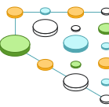
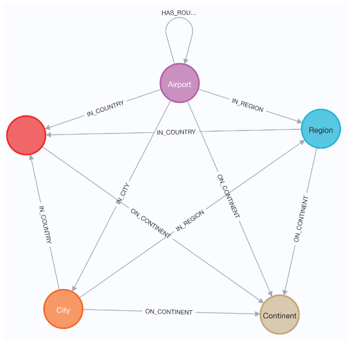
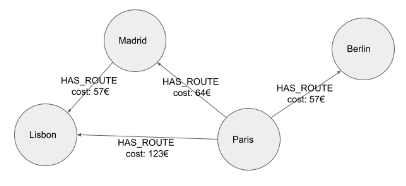

# Path Finding with GDS





## Table of Contents
1. [Finding Shortest Paths using Cypher](#chapter_1)
2. [Weighted Shortest Paths with GDS](#chapter_2)


## Chapter 1 - Finding Shortest Paths using Cypher <a name="chapter_1"></a>

In this section, you will learn how to use the Cypher query language to find the shortest paths between pairs of nodes in the graph.

### Domain model for this course

The dataset we will use is represented in the figure below.



- (:Airport) nodes are identified by a unique .iata property, a .name, and latitude and longitude data held in a .location point property.
- Airports have an outgoing relationships to (:Region), (:Continent), (:Country) and (:City) nodes which creates a geographical hierarchy.
- Airports are linked together through :HAS_ROUTE relationships, signifying where it is possible to travel from that airport.
- Each :HAS_ROUTE relationship has a .**distance** property which we will use to calculate the cost of travelling between two airports.

### Shortest Paths with Cypher

Imagine that you are asked to build a web application that will allow users to **find the shortest, or cheapest route between two airports**. The user selects an origin and destination airport, and it is the responsibility of the application to suggest routes between them.

The Cypher query language was designed to efficiently match patterns in a graph using a declarative syntax. Writing a Cypher query to identify possible routes between two airports becomes a trivial task compared to other database query languages.

#### Unweighted Shortest Path

**Cypher** supports the calculation of the shortest unweighted path between a pair of nodes with the **shortestPath()** function.

In an unweighted path, the traversal of each relationship has an identical cost, so the shortest path between two nodes will always be the sum of the total relationships in a path between them.

#### How it works

The traversal is **breadth first**, meaning that all relationships from a node will be followed before traversing further through the graph.

The **state** of the traversal is held in memory, **pruning** or removing paths that are longer than the current shortest path as it goes.

The overall shortest path is calculated as the shortest path length between the two nodes, or in other words, the smallest number of relationships in the path.

The **output of the function** is the **single shortest path** between the two nodes.

#### An example

Say we would like to find the shortest route between Baltimore and Frankfurt, we could run the following query.
```
MATCH (source:Airport {city:"Baltimore"}),
      (target:Airport {city:"Frankfurt"})
MATCH p = shortestPath((source)-[:HAS_ROUTE*1..10]->(target))
RETURN p
```

- We start off by using the MATCH clause to find the source and destination (:Airport) nodes by the city property.
- The shortestPath() function calculates and returns a Path object.
- The *1..10 portion of the statement specifies that the path should contain between 1 and 10 relationships.

---

**Limiting the number of relationships**

It is good practice to specify a range of relationships (i.e. [:RELATIONSHIP*1..10]). This ensures that excessively long relationships are not queried or returned - improving query performance and constraining the result.

You can include any number of relationships by omitting the range and using [:RELATIONSHIP*].

---

#### Finding All Shortest Paths

The **allShortestPaths()** function works in the same way as the shortestPath() function, but instead of returning the first shortest path, the function will return all paths that contain the shortest number of relationships.
```
MATCH (source:Airport {city:"Baltimore"}),
      (target:Airport {city:"Frankfurt"})
MATCH p = allShortestPaths((source)-[:HAS_ROUTE*1..10]->(target))
RETURN p
```


## Chapter 2 - Weighted Shortest Paths with GDS <a name="chapter_2"></a>

### Weighted Shortest Paths

In a property graph, relationships can have properties assigned to them. In graph theory, **relationship properties are referred to as weights**. A weight is a numerical property which represents the *cost of traversing that relationship, whether that is distance, time, financial cost or any other factor.*



### Projecting Weighted Graphs in GDS

To use the weighted shortest path algorithms built into the Neo4j Graph Data Science library, you will **first** need to **create a graph projection in memory** using the gds.graph.project() procedure.

The **relationshipProperties** configuration parameter has three possible inputs:

|Type | Description | Example |
|-|-|-|
|String | To be used when your projected graph should contain a single relationship property. | "cost" |
| List of strings | To be used when you need to add multiple relationship properties to the projection. | ["cost", "distance"] |
| Map | To be used when you need to add multiple relationship properties to the projection, while also providing a default value if one does not exist. | { cost: {defaultValue: 1000}, distance: {defaultValue: 25 }} |

In our dataset, we only have one property to represent weight, .**distance**, and it is present for all relationships so we don’t need to provide a default value. So in this case **we can use a single string**.

You can run the following Cypher statement to project the airport routes graph along with the distance relationship weight:
```
CALL gds.graph.project(
  'routes',                          
  'Airport',                         
  'HAS_ROUTE',                       
  {relationshipProperties:'distance'}
);
```

### Common Weighted Shortest Path Algorithms

In this lesson, we will cover two of the most commonly used algorithms that come with the Neo4j Graph Data Science library.

- Dijkstra Source-Target Shortest Path
- Yen's

#### Dijkstra Source-Target Shortest Path

The Dijkstra Source-Target algorithm is a commonly used algorithm for **finding the shortest weighted path between a source and a target node**.

---

**Positive Weights Only**

Dijkstra’s algorithm supports weighted graphs with positive relationship weights only. If you have any negative weights, the algorithm will not work correctly.

---

Cypher statement to calculate the shortest weighted path between Paris Charles de Gaulle (CDG) and Lisbon Portela Airport (LIS) and stream the results:
```
MATCH (source:Airport {iata: "CDG"}),  
      (target:Airport {iata:"LIS"})

CALL gds.shortestPath.dijkstra.stream(
  'routes',  
  {
    sourceNode: source, 
    targetNode: target, 
    relationshipWeightProperty: 'distance' 
  }
)
YIELD nodeIds, costs, totalCost
RETURN [nodeId in nodeIds | gds.util.asNode(nodeId).descr] AS airports, costs, totalCost
```

#### Yen’s Algorithm

Yen’s **k-Shortest Path algorithm**, also referred to as Yen’s Shortest Path algorithm is similar to Dijkstra’s shortest path algorithm with the exception of a configurable k value, where k represents the number of shortest paths to return.

The algorithm makes sure that an already discovered shortest path will not be traversed again.

```
MATCH (source:Airport {iata: "CDG"}),
      (target:Airport {iata:"LIS"})

CALL gds.shortestPath.yens.stream(
  'routes',
  {
    sourceNode:source,
    targetNode:target,
    relationshipWeightProperty:'distance',
    k:3
  })
YIELD index, nodeIds, totalCost
RETURN index, [nodeId in nodeIds | gds.util.asNode(nodeId).descr] AS airports, totalCost
```

